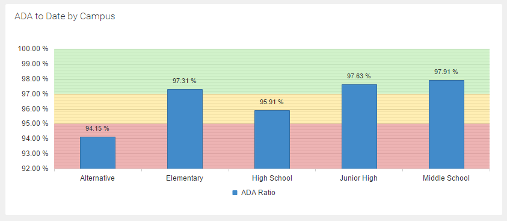
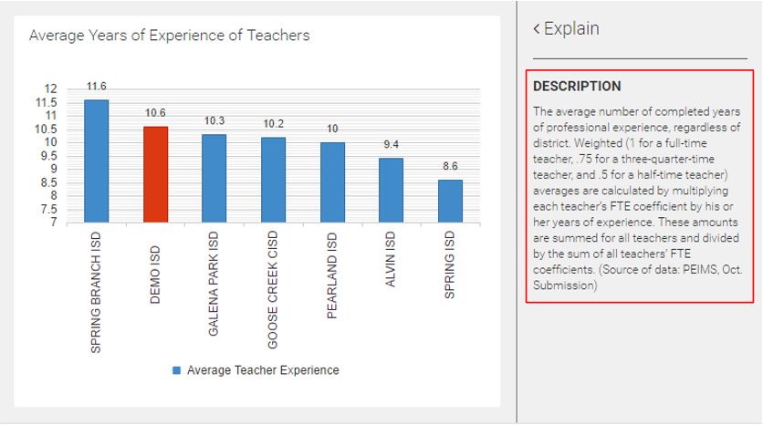

# Release History

## Upcoming 

New features we're working on for upcoming releases include:

<p class="upcoming"><span class="label"></span>Teacher Scorecard</p>

The new teacher scorecard will provide a unique perspective on performance specifically for students in the selected teacher's classroom.

<p class="upcoming"><span class="label"></span>Watch List Results Redesign</p>

After completing the redesign for watch list creation, we've now begun focusing on redesigning the way watch list results are displayed. Major changes include:

* New visually appealing grid layout.
* Increased flexibility with selecting information displayed in results grid.
* Ability to include watch list criteria items in the results grid.
* Expandable rows that reveal additional insights into student characteristics and performance.

You're welcome to check out and provide feedback on our [conceptual mockup](https://embed.plnkr.co/V4d3eBcIsDuqN69071I9/?show=preview) of the new design.

<p class="upcoming"><span class="label"></span>Local Data Management Capabilities</p>

Currently, all data warehouse information is sourced from external systems, either from the customer or from published sources. In some cases, required information is not available in the customer's student information system, which leads to challenges with creating the data files required for import into D3.

To address this, we are introducing local data management capabilities to D3, designed to bridge the gap between data used by D3 versus data available from the customer's systems. We will be supporting both attribute and file based maintenance scenarios:

* **Attribute maintenance example**: The School file gets imported into D3 with some missing metadata fields. The customer updates missing metadata using D3 Local Data Maintenance. Next time the School file gets imported, the metadata in D3 should not get overwritten with empty values from the file.

* **File maintenance example** The Action Category file is missing in the file import, and thus ActionCategoryCode has no values in the ActionType file. Using D3 Local Data Maintenance, the customer first creates action categories, then assigns action categories to the existing ActionTypes. Next time the ActionType file gets imported, action category codes do not get overwritten. 
-->
<p class="upcoming"><span class="label"></span>More Granular Attendance Tracking</p>

Today, D3 captures daily attendance information only. This information is also used in conjunction with the school calendar to identify student enrollment metrics. 

We will be introducing a new approach for enrollment and attendance tracking that supports per-period attendance records. Availability of this additional information will enable new dimensions of student analysis on the impact that absence has on student behavior and performance, as well as provide useful reporting capabilities to teachers for individual classes or courses.

## January 2017 Release

<p class="new featured"><span class="label"></span>New Dashboards for Daily Attendance</p>

D3 now recognizes two kinds of daily attendance tracking, which are represented in the Attendance and ADA dashboards. The first dashboard reports on students that are included in total attendance counts. The second dashboard reports specifically on the ADA (Average Daily Attendance) funding metric.


<p class="new featured"><span class="label"></span>Section 504 Mapping from Skyward</p>

Skyward includes dedicated Special Education module that supports Texas Education Agency requirements for public schools. Private schools, however, may instead use the Section 504 Module as a more lightweight solution for managing compliance of special education requirements. For applicable customers, D3 now supports a configured setting to automatically map Section 504 data into our Special Education dataset.

<p class="new featured"><span class="label"></span>New Filename Convention for Files Exported from Explorer</p>

Previously, exporting an exploration to Excel produced a filename consisted of numbers representing the date and time, and exporting to PDF or PNG used a file name of "Data Exploration". Now, all formats are treated the same. When a new exploration is exported, it will have the name "Unsaved Exploration", and when an existing exploration is exported, the filename will be the name of the saved exploration.

<p class="new featured"><span class="label"></span>Align Discipline Disproportionality to TEA Submission Specifications</p>

1. Enrollment counts used in discipline disproportionality calculation now uses the total number of distinct students enrolled at any time during the school year (instead of enrollment as-of last day of school).

2. In case of multiple actions within categories of ISS, OSS, and DAEP, count a maximum of one-time per incident for each category.

<p class="fixed"><span class="label"></span>Default school filter settings not updated when user's role changed (#3742)</p>
<p class="fixed"><span class="label"></span>Details of complex search criteria are not shown in watch list sidebar configuration section (#3734)</p>
<p class="fixed"><span class="label"></span>Missing attachment when sending by email export of chart in Excel format (#3720)</p>
<p class="fixed"><span class="label"></span>SMI student count measure has incorrect format (#3708)</p>
<p class="fixed"><span class="label"></span>Some SMI charts show no data when looking at prior school years (#3707)</p>
<p class="fixed"><span class="label"></span>Some search criteria not persisted after editing existing watch list (#3699)</p>
<p class="fixed"><span class="label"></span>Search button on criteria step of static watch list causes error (#3684)</p>
<p class="fixed"><span class="label"></span>Error launching explorer from scorecard grid (#3669)</p>
<p class="fixed"><span class="label"></span>Use KPI color coding standard for SMI scorecard grids (#3668)</p>

## December 2016 Release

<p class="new featured"><span class="label"></span>2016 Accountability Ratings and TAPR Information Now Available</p>

2016 school data, published by the Texas Education Agency, has been imported into D3. Take a moment to review more than 100 charts available in the TAPR dashboards to review your district's academic performance relative to comparable districts.


<p class="new"><span class="label"></span>Retain criteria when changing watch list type</p>

There's nothing worse than setting up your finely tuned criteria for a dynamic watch list, then deciding to change it to point-based and having to setup the criteria details again. With this enhancement, your configuration details are now preserved when you change the watch list type.

<p class="new"><span class="label"></span>All watch list criteria fields now support selection of multiple items</p>

The ability to choose multiple criteria for Campus, Grade Level, Days Absent, and Out-of-School Suspensions is now implemented. Now, all fields support creation of multiple criteria.

<p class="fixed"><span class="label"></span>Watch lists with large amount of data are not loaded in preview tab (#35467)</p>
<p class="fixed"><span class="label"></span>Error message is displayed when clicking cancel button in Send to modal (#3548)</p>
<p class="fixed"><span class="label"></span>Formatted values in y-axis incorrect in some charts (e.g. SMI %Student Meeting Expected Growth (#3497)</p>
<p class="fixed"><span class="label"></span>Repeatedly selecting and unselecting filters causes loss of synchronization with displayed chart information (#3477)</p>

## November 2016 Release

<p class="new featured"><span class="label"></span>Apply Global KPIs to Categorical Charts</p>

Previously, KPIs were applied to gauge charts and scorecards. Now, column and line charts also include visual feedback when an associated KPI is setup by displaying plot bands on the chart surface area. 



<p class="new featured"><span class="label"></span>Major Changes to Dashboard Filters</p>

We took a good hard look at the way our "global" filters work for dashboards after noticing that this functionality has been a source of confusion for customers. As a result, the concept of dashboard filters has been entirely redesigned.

* **Filter changes are no longer persisted for the user**

Automatically saving the last set of filters applied to dashboards and charts has been confusing for the user and we decided it was not especially useful. Users would rather return to the published state of the dashboard on future visits, rather than to the data representation of their last set of applied filters. If a permanent change to the filters is desired, this can be achieved by creating a new dashboard or modifying it if it's a personal dashboard.

* **When a chart is selected, filter changes now only apply to the selected chart**

Previously, the available filters for a selected chart included both chart-specific filters as well as "global" filters. It was confusing that some filters affected the entire dashboard even when a chart is selected, whereas others only affected the selected chart. Now, filter changes applied when a chart is selected, always affect only the selected chart.

* **Indicate multiple filter states when a chart is not selected**

As a result of the previous point, we now needed a way to manage the display and use of filters on the dashboard when no chart is selected. For example, the dashboard as a whole may be filtered on the current school year, but one of the charts is now filtered on a different school year. To solve this, each filter checkbox now supports a third "mixed" state, which indicates that the filter criteria is on for some charts in the dashboard and off for others. As you can see in the image below, the mixed state selection is indicated by a minus-sign inside the checkbox:


* **"Global" dashboard filters are now dynamically identified**

Previously, filters that should apply to the dashboard as a whole needed to be manually identified and configured for each dashboard. Now, those filters are automatically identified by surfacing to the dashboard those filters common to all charts.

<p class="fixed"><span class="label"></span>Gauge invisible on initial load (#3183)</p>

<p class="fixed"><span class="label"></span>Explain text does not get refreshed when navigating from Quick Search (#3134)</p>

<p class="fixed"><span class="label"></span>"Two or more races" appears twice in State Assessment by Race scorecard (#3161)</p>

## October 2016 Release

<p class="new featured"><span class="label"></span>New Watch List Creation Wizard</p>

We have released the first phase of our new watch list design, which delivers a brand new experience for building watch lists. You now have significantly more power in specifying criteria for matching students, as well as a new ability to build point-based watch lists.

* **New Wizard-Based Approach**

Previously, we supported two kinds of watch list, static and dynamic. Choosing and using the right one could be a bit confusing. Plus, with our redesign, a variant of the dynamic type is being introduced, called point-based, so we would now have three kinds of watch list, which would further exasperate the issue.

To simplify the user experience with creating (and modifying) watch lists, we've adopted a wizard-style approach, wherein the user makes choices as they proceed through a series of steps. The first step is to choose the watch list type:


Once a watch list type is selected, the remaining steps are revealed:


* **Grouped Search Criteria with Summary of Selections**

Over time, the available watch list search options has grown. With the redesign, these search options are grouped together using an accordion-style layout, which expands only one section at a time. Additionally, as search fields are filled out, tags are displayed above to summarize the current search options.


 
* **Intuitive Management of Static Watch Lists**

For static watch lists, results are shown inline to the current wizard step. The user can easily add and remove students, and see a set of tags representing the set of added students.


* **More Powerful Search Criteria**

Previously, watch list criteria used an assumed "current" context, such as current school year, or currently placed in a program. This restriction is gone with the new design.

For date-based events, you can now specify the context of current school year, previous school year, current term, or previous term. Similar flexibility is provided for program placement, providing options for currently placed, previously placed (dropped), currently or previously placed, or never placed.

Additionally, you can now specify a type of criteria multiple times allowing you to combine criteria in different contexts. For example, you could identify students for which excessive absenteeism only started in the current school year. To do this you would specify attendance (or absence) criteria multiple times, such as  has been absent more than 10 times this school year, but was absent in the previous school year less than 6 times.


* **Point Assignment Criteria**

This customer-requested feature allows you to define student inclusion in a watch-list based on the accumulated point value of various criteria. When selecting this type of watch list, an additional step called Point Assignments is displayed after the Search Criteria step.

You specify a point value for each criteria, and a total number of points needed from the matched criteria for a student to be included in the watch list. You can also omit a point value, which requires that the criteria is met for inclusion.


* **Configure Columns Displayed in Watch List Results**

The new watch list creation wizard also now allows you to specify which columns to include in your results, and also preview the results before saving.  


We are now working on phase 2 of the watch list redesign project, which is a new design for displaying  matching students. This will change the current implementation of the Select Columns and Preview steps in the watch list wizard.
 
<p class="new featured"><span class="label"></span>Send Email Improvements</p>

We've made a couple of improvements to clarify who the sender is when emails are sent from D3 using the Send To Email feature. First, the display name of the from address is now set to the first and last name of the logged in user. Second, the logged in user is now automatically cc-ed on the emails.

<p class="fixed"><span class="label"></span>Infographic displayed incorrectly in some summary scorecard grids (#2914)</p>

<p class="fixed"><span class="label"></span>Gauge chart does not resize until the sidebar is opened or closed (#2536)</p>

<p class="fixed"><span class="label"></span>NaN in scorecard grid (#2671)</p>

<p class="fixed"><span class="label"></span>Missing sparklines in Istation grids (#2840)</p>

<p class="fixed"><span class="label"></span>"Undefined" is displayed instead of the filter values in data explorer (#2949)</p>

<p class="fixed"><span class="label"></span>Scorecard display issue when using year-over-year (#3035)</p>

<p class="fixed"><span class="label"></span>User role appears multiple times when searching users (#3068)</p>

## September 2016 Release

<p class="new featured"><span class="label"></span>Launch of Preview Environment</p>

Changes to the production D3 environment are usually made once a month, but we wanted a way for customers to try out new features currently under development and provide feedback for their official release. To address this, we now have a preview environment available to customers, which is automatically updated every time a developer commits code changes.

Your account manager will provide details for using the preview environment when applicable.

<p class="new featured"><span class="label"></span>Legend Now Available In Data Explorer</p>

Legend information is now available in the data explorer sidebar for the selected exploration level, with the ability to toggle visibility and change colors. 


<p class="new featured"><span class="label"></span>New TAPR Dashboards</p>

Three new TAPR dashboards: Advanced Course/Dual Enrollment, Graduates, and SAT/ACT dashboard. Most of the charts in these new dashboards are new while some were moved from the existing TAPR College Readiness dashboard.


<p class="new featured"><span class="label"></span>Improved Special Education Discipline Dashboard</p>

Our Special Education Discipline dashboard includes charts that report on the various metrics needed for identifying discretionary discipline disproportionality between all students and special education students. For this release, we've combined multiple charts to improve readability, introduced a new chart that displays ISS, OSS, and DAEP disproportionality rates, and replaced the "Count of Non-SPED Students" series with "Count of All Students".  


<p class="new featured"><span class="label"></span>Remember Changes to Sort Order</p>

When a user changes the sort order of a chart, D3 now remembers the change and defaults to the last sort order selected by the user when the chart is viewed at a future time.

<p class="new featured"><span class="label"></span>Find Student By Id in Global Search</p>

The global search tool (activated by clicking the search box on the top right) can now be used to locate students by their student id.

<p class="new featured"><span class="label"></span>Reset Color</p>

We've added the ability to reset to the default color from the legend color selection dialog. 

<p class="fixed"><span class="label"></span>Explain text not updated when a new filter is applied (#2448)</p>

<p class="fixed"><span class="label"></span>Misaligned header cells in watch list when sidebar is opened (#2451)</p>

<p class="fixed"><span class="label"></span>Total count of items in published watch list is reported incorrectly (#2480)</p>

<p class="fixed"><span class="label"></span>Blank screen opening D3 for certain customers in IE 10 or 11 (#2515)</p>

<p class="fixed"><span class="label"></span>No students from iStation results meeting expected growth in prior school years (#2516)</p>

<p class="fixed"><span class="label"></span>Min/max/range issue with specific charts (#2529)</p>

<p class="fixed"><span class="label"></span>Save as command in Explorer asks to overwrite exploration which does not exist (#2533)</p>

<p class="fixed"><span class="label"></span>&lt;Unsaved Changes&gt; appears when opening an existing exploration (#2534)</p>

## August 2016 Release 

<p class="new featured"><span class="label"></span>New Color Themes</p>

D3 has always used a crisp light theme designed for high usability with a clean, professional experience. We recognize though that some people prefer a darker screen,and people with visual impairments benefit from an increased contrast between colors. As a result, D3 is now available in three beautiful color themes: Light (the default), High Contrast, and Dark. Theme preferences are controlled from the settings area accessed from the main menu.


<p class="new featured"><span class="label"></span>Improvements to Search Capabilities</p>

Our search capabilities have always focused on ease-of-use. Just type a few letters, and immediately see the top results categorized by the type of the item (e.g. dashboard, chart, scorecard, student, exploration). One limitation though, is that only the first 6 results for each item type were displayed. With this month's release, a `SEE MORE` button is now displayed underneath the initial results when applicable. Clicking the button will expand the view to show a complete listing of all matches. The results are organized by tabs. The first tab has all results organized alphabetically. The other tabs act as filters to show all results of a particular item type.


Additionally, the search box will now also recognize student numbers, which provides a convenient  method for locating a student scorecard when you have the student number handy. 

<p class="new featured"><span class="label"></span>Toggle Measure Visibility in Charts</p>

For our charts that display multiple measures, you now have the ability to selectively hide or show each measure individually. The legend section of the sidebar was redesigned to support this. Previously, the legend items could be clicked to adjust their color. Now, clicking a legend item expands it to display a sub-menu of actions from which you can toggle the visibility or change the color.


<p class="new featured"><span class="label"></span>Ability to Specify Ranges when Filtering Date Category Items</p>

Applying a filter in D3 requires selecting the individual member values to filter on. This works well in most cases, but not for dates. When filtering on a date, the user invariably wants to specify a date range (or multiple date ranges). To address this, we improved our filtering user interface to provide a new experience when creating a date-based filter. You now pick a start date and end date (or you can leave one blank). You can even add additional date ranges if you need to.


<p class="new featured"><span class="label"></span>Auto Hide Legend Items</p>

A large number of legend items in charts reduces the available plot area of the chart significantly. 
When viewing charts contained within dashboards or within the Explorer, this can lead to charts that are too hard to read. 
To resolve this, we now automatically hide the legend items from the chart area when needed for the chart to be easily legible.
When legend items are hidden from the chart, you can still view this information by opening the sidebar.


<p class="new featured"><span class="label"></span>Reset Custom Colors</p>

A `Reset to default` button is now available on the color picker dialog. This provides a way to clear a customized color assignment. Access it from the sidebar legend by clicking `Change color`.

<p class="new featured"><span class="label"></span>New Mouse Shortcut</p>

When using a desktop computer, a new double-click shortcut is now available to quickly switch back to the dashboard view after viewing a maximized chart.

<p class="fixed"><span class="label"></span>Only watch list owner should be able to edit watch list (#2479)</p>

## July 2016 Release

<p class="new featured"><span class="label"></span>Sort Options Now Available for Library Charts</p>

The Data Explorer has has a `Sort by` action available in the sidebar for some time, but until now this capability has been missing for existing charts in the library. Now you can organize items in a chart explicitly by the value (descending) or their category name (alphabetically).  


<p class="new featured"><span class="label"></span>Special Education Domain</p>

We've introduced support for data requirements specific to students enrolled in special education programs.
In addition to identifying students enrolled in special education, D3 can now track
the primary, secondary and tertiary (if applicable) disability of special education 
students, the special education services provided to each student, and each student's instructional setting. We've also enhanced the disciplinary reporting to include charts that compare disciplinary activities between special education students and all students.

<p class="new featured"><span class="label"></span>Data Explorer Saving / Sharing Improvements</p>

The ability to save an exploration and share it with others has been redesigned. Previously, the
behavior was confusing, especially when a shared exploration was further modified. We determined that the root of the confusion was due to our saving of changes to an exploration, which was automatic for the owner but not persisted at all when modified by another user. 

To resolve this, the functionality of the `Save as...` action in the Explorer sidebar has been improved. A modified exploration is only updated by selecting this action.  A copy of an exploration can be created by using this action and providing a different exploration name.

This new behavior works equally well when a second user opens an exploration saved by the first user. In this case, the `Save as...` action will create a local copy of the exploration belonging to the second user.

Along with this enhancement, the screen title will now display the name of a saved exploration, or `<New Exploration>`. In addition, <Unsaved Changes> is displayed to alert you that you have made modifications to the exploration. In the case, or a second user opening a shared exploration, `<Not Saved>` will be displayed.   

<p class="new featured"><span class="label"></span>Dynamic Explanations in Data Explorer</p>

The Explain sidebar action available in dashboards and charts is now also available in data explorer. Just select an explorer 
level and click Explain to view a dynamic description of the selected chart configuration as well as a statistical analysis 
of the explorer measure values.


<p class="new featured"><span class="label"></span>Pie Chart Legends</p>

Pie chart legend details displayed in the sidebar now include values. 
Previously, this information was not available to users on mobile devices 
since the values were only shown in the tooltip of each pie slice.


<p class="new featured"><span class="label"></span>STAAR Grades 3-8 Assessments</p>

We've just added support for STAAR Grade 3-8 files, so now your scorecards and dashboard will display both 3-8 and EOC results.

<p class="new featured"><span class="label"></span>New TAPR HR charts</p>

Teacher Diversity and Teacher Years of Experience charts added to TAPR HR dashboard.

<p class="new featured"><span class="label"></span>Add Select All Option to Data Explorer Filters</p>

The ability to select all filter items now available in Explorer. This is particularly useful for selecting all except for a few items. First click the `Select All` checkbox, then un-check items you want to exclude.


<p class="new featured"><span class="label"></span>Favorites are now sorted alphabetically</p>

Previously, the favorite items were listed in the order they were added as favorites.

<p class="fixed"><span class="label"></span>Filters with no selections appear in the Explain area (#2285)</p>

## June 2016 Release

<p class="new featured"><span class="label"></span>TEA Chart Explanations</p>

Proper interpretation of state-published information is essential, but it can be 
difficult to correlate essential metrics to nomenclature definitions published 
in documents such as the 36-page TAPR glossary of terms. We've made it easy for you by now include explanations for every chart based on state information.



<p class="new featured"><span class="label"></span>Collapse/Expand All Levels in Data Explorer</p>

It's not uncommon to explore several levels deep when using the data explorer. You've always been able to collapse and expand individual levels, but now you can collapse all levels at once to see at a glance a breadcrumb trail of your exploration. When collapsed, the option changes to expand all levels.


<p class="fixed"><span class="label"></span>In IE, the My Items folder is not positioned at the top of the list of library items (#2205)</p>
<p class="fixed"><span class="label"></span>In some cases, selecting `Reset all` does not reset all filters to their original state (#2122)</p>
<p class="fixed"><span class="label"></span>In charts and dashboards, child filters should be reset when parent filter is selected (#2121)</p>
<p class="fixed"><span class="label"></span>Bar selection in data explorer charts does not work in certain cases (#2137)</p>
<p class="fixed"><span class="label"></span>Do not all deletion of a user chart if it is referenced in a dashboard (#2074)</p>

## May 2016 Release

<p class="new featured"><span class="label"></span>TAPR Dashboards</p>

Published data from Texas Education Agency is now available within D3 to provide comparisons of academic performance against other districts.
Over 100 new charts have been added, organized by functional area into 8 distinct dashboards.


<p class="new featured"><span class="label"></span>Assigned Principal Perspectives</p>

We've added a new filter to applicable charts so you can now target time periods that one or more selected principals were responsible for their school(s).


<p class="new featured"><span class="label"></span>Automatically filter student results using classroom assignment for teacher role</p>

Teachers can now enjoy charts and dashboards tailored to show results from the students they teach.

<p class="fixed"><span class="label"></span>Grid columns are misaligned in data view for some charts (#2072)</p>
<p class="fixed"><span class="label"></span>Error when displaying diversity charts in dashboard (#2030)</p>
<p class="fixed"><span class="label"></span>Unable to explore scorecards that have multiple measures (#2028)</p>
<p class="fixed"><span class="label"></span>The home screen is shown after login expiration rather than the item specified in the URL (#2023)</p>
<p class="fixed"><span class="label"></span>Rename EOC Tracker to Student Tracker (#1986)</p>
<p class="fixed"><span class="label"></span>Wrap long filter selection names to multiple lines for improved readability (#1982)</p>
<p class="fixed"><span class="label"></span>Vertical scrollbar appears in chart data view even if it's not needed (#1940)</p>
<p class="fixed"><span class="label"></span>Do not show empty folders in library. This is needed for the teacher role (#1963)</p>

## April 2016 Release

<p class="new featured"><span class="label"></span>User Impersonation</p>


We're often asked by users what other information is D3 is shown for other users. D3 uses a combination of roles, 
associations, and attributes to manage the information displayed for each individual user, so knowing what another
user can see isn't always obvious. To resolve this, we've just added a really useful impersonation feature available to users
who are responsible for managing access to D3. 

```eval_rst
For more information, read our :ref:`User Impersonation <admin-impersonation>` topic.
```

<p class="new featured"><span class="label"></span>Enhancements to the Discipline Domain</p>


We've made some enhancements to the data we collect about disciplinary information. We now capture the referring party for each 
discipline incident and also the administration assigned for managing each associated discipline action. Plus, we now capture the 
time of day that discipline incidents are reported so you can analyze what types of incidents are occurring at different times of the day.  

We have new charts to show this information, plus it's available in the data explorer so you can create your own charts too.

<p class="fixed"><span class="label"></span>Loss of data view in bottom exploration level (#1868)</p>
<p class="fixed"><span class="label"></span>Display a message indicating when there are no watch lists available (#1753)</p>
<p class="fixed"><span class="label"></span>Show busy indicator while generating dashboard export to Excel or image (#973)</p>
<p class="fixed"><span class="label"></span>Infographic displays incorrectly when there is no All School Year column (#1816)</p>
<p class="fixed"><span class="label"></span>Error occurs when deleting chart from My Items (#1843)</p>

## March 2016 Release

<p class="new featured"><span class="label"></span>Watch List Improvements</p>


You can now access a student's scorecard directly from a watch list.

The display of watch list results also received a facelift with a new grid display and the addition of pagination controls.

<p class="new featured"><span class="label"></span>Introduce Feature Toggle</p>

We've introduced an internal feature toggle capability to allow us to turn on features currently under development for
review by certain districts or users. This helps us gather feedback from real world users during development.

<p class="fixed"><span class="label"></span>Include course section and teacher categories in popular results (#1850)</p>
<p class="fixed"><span class="label"></span>No data is displayed for second value in explorer (#1842)</p>
<p class="fixed"><span class="label"></span>Remove All School Years column from the Enrollment score cards (#1802)</p>
<p class="fixed"><span class="label"></span>Top n filter not applied to chart created from Explorer (#1801)</p>

## February 2016 Release

<p class="new featured"><span class="label"></span>Quick Search</p>


We've introduced a new universal search capability so you can quickly locate any item by typing a few letters of its name. 
As a bonus, the search screen also displays your more recently accessed items as well the most popular items accessed by users in your organization. 

<p class="fixed"><span class="label"></span>Show additional columns does not work for Top N levels (#1741)</p>
<p class="fixed"><span class="label"></span>Items removed from Watch List still marked as added in search view (#1773)</p>
<p class="fixed"><span class="label"></span>Should be able to add user created charts to new dashboard (#1764)</p>
<p class="fixed"><span class="label"></span>Layout issue in student enrollment grid (#1737)</p>
<p class="fixed"><span class="label"></span>Cannot navigate backwards from quick search (#1677)</p>

