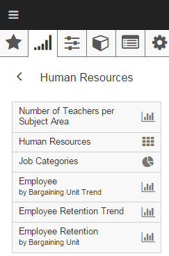

```eval_rst
.. _features-chart-library:
```
# Chart Library

## Introduction

The chart library feature provides access to the many charts and dashboards available in D3.

To access the chart library, click the main menu icon at the top left of the screen. The chart library is activated by selecting the second tab in the menu (identified by the chart icon).

The chart library is organized into sections, such as Academics, Finance, and Human Resources. Some sections that contain a lot of charts will include additional sections within them. You can navigate the chart library just like a folder tree.

```eval_rst
.. _features-my-items:
```
## My Items Folder

The first item in the chart library is called "My Items". This is a folder that contains all the personal charts and dashboards created by you.

```eval_rst 
.. warning::
   The "My Items" folder is not displayed until you create your first personal item.
```

```eval_rst
:ref:`Learn more <features-my-items>` about creating and managing your charts and dashboards in the My Items folder.
```

## About Charts and Dashboards

A dashboard is a collection of charts. Functional area dashboards contain charts related to the specific function. You can also create your own personal dashboards containing any selection of charts.

Both dashboards and individual charts are available in the chart library.

Selecting an individual chart in the library will open that chart at full-size and display applicable information and actions for the selected chart in the sidebar. Conversely, selecting a dashboard displays multiple charts at once, and provides applicable dashboard actions in the sidebar.

The following picture shows a variety of library items within the Human Resources folder. Notice the icon used for the dashboard named "Human Resources", versus the icons used for individual charts, which will vary depending on the chart type.



### Selecting a Chart Within a Dashboard

Dashboards show their charts at a smaller size to facilitate the dashboard-style view. When viewing a dashboard, the sidebar initially displays applicable information and actions for the dashboard as a whole.

The application enables you to work with the dashboard as a whole or with an individual chart within the dashboard. To activate an individual chart, you select it by clicking or tapping the chart on the dashboard. A border will be displayed around the chart to indicate it is active, and the sidebar information will change to provide information and actions specific to the selected chart.

You can open a chart within a dashboard to full-size by choosing "View" from the sidebar once the chart is selected. 

```eval_rst
.. tip::
   If you are using a device with a mouse, you can also double-click a chart within a dashboard to open it full-size.
```

To go back to the original dashboard view, just select the "Dashboard" action from the sidebar.

### Dashboard Layout

Dashboards present multiple charts in a grid of columns and rows. Generally, a chart occupies a single cell (intersection of column and row); however, some charts use 2 columns on a single row – this is done selectively to enhance visualization of data presented in certain charts. Note the top right and bottom left charts in the figure below to see multi-cell charts.
Dashboard layout is completely dynamic: as more charts are added to (or removed from) a dashboard, the layout is expanded or collapsed, depending on the number of charts. 


On smaller hand-held devices, charts are displayed in a single column. Each chart occupies the device’s screen entirely. Scroll down or up to view additional charts.


## Dashboard Sidebar

Users can perform various actions on dashboards. These actions are available from the sidebar, which is activated by clicking the double-left arrow icon, located at the top right of the D3 screen. Actions applicable to the dashboard as a whole are enabled as shown below; disabled actions are reserved for selected charts only.


```eval_rst
.. tip ::

    **Hiding Actions Menu:** When the Action Menu is opened, the icon is switched to a double right arrow icon; to close the Action menu, click the double right arrow icon
```

### Send To Options
The `Send to...` item displays a sub-menu with various options as follows:


* **Printer**: Allows the user to print the dashboard. The user is presented with the Print dialogue box to select the printer. 

* **Email**: Allows the user to email the dashboard. This invokes a dialogue box that asks the user to enter one or more eMail addresses, a subject line, and a message. Upon clicking Submit, the eMail is sent with the dashboard as a jpg attachment.

* **Save as image**: Allows the user to save the dashboard as a jpg image to any drive attached to the user’s local device. The image can later be inserted in documents as needed for internal or external district/campus communications.

* **Save as PDF**: Allows the user to save the dashboard as a PDF document. The user is presented with the Save as dialogue box where the user can select the name of the desired PDF file as well as the drive and folder where to save the PDF file.

* **Export to Excel**: Allows the user to export the data for each chart displayed in the dashboard. The data for each chart is saved as a separate tab within the same Excel file; each tab is labeled with the corresponding chart name. 
When the user selects Export to Excel, an Excel file is created with a generic name and is downloaded to the local device’s Downloads folder. You can navigate to the file and open it or use browser to view it.


### Working with Filters
D3 dashboards present information at the highest aggregation level possible for the role of the logged in user. Filters allow users to narrow the scope of the data presented in a specific dashboard by excluding certain subsets of information.

Each functional area includes a specific set of filters applicable to the corresponding function:

<div class="wy-table-responsive">
<table class="docutils">
    <thead>
        <tr>
            <th>Functional Area</th>
            <th>Filters</th>
        </tr>
    </thead>
    <tbody>
        <tr>
            <td rowspan="6">Academics</td>
            <td>Campus Type</td>
        </tr>
        <tr>
            <td>Campus</td>
        </tr>
        <tr>
            <td>Grade Level</td>
        </tr>
        <tr>
            <td>Program Type</td>
        </tr>
        <tr>
            <td>Gender</td>
        </tr>
        <tr>
            <td>Race/Ethnicity</td>
        </tr>
        <tr>
            <td rowspan="8">Finance</td>
            <td>Financial Unit Group</td>
        </tr>
        <tr>
            <td>Financial Unit</td>
        </tr>
        <tr>
            <td>Function Group</td>
        </tr>
        <tr>
            <td>Function</td>
        </tr>
        <tr>
            <td>Object Group</td>
        </tr>
        <tr>
            <td>Object</td>
        </tr>
        <tr>
            <td>Fund Category</td>
        </tr>
        <tr>
            <td>Fund</td>
        </tr>
        <tr>
            <td rowspan="6">Human Resources</td>
            <td>Campus Type</td>
        </tr>
        <tr>
            <td>Campus</td>
        </tr>
        <tr>
            <td>Location</td>
        </tr>
        <tr>
            <td>Bargaining Unit</td>
        </tr>
        <tr>
            <td>Education Level</td>
        </tr>
        <tr>
            <td>Total Experiences</td>
        </tr>
    </tbody>
</table>
</div>

#### Selecting a Filter

Data presented in all charts of the currently selected dashboard can be filtered to exclude certain dimensions or categories of data.

```eval_rst
.. _how-do-i-dashboard-apply-filter:
```
<div class="task-title">
How do I apply dashboard filters?
</div>

1.  <span class="task-item">Click Filters in the action menu</span>

    This presents the user with the applicable filters for the functional area.

2.  <span class="task-item">Click the filter name you wish to use</span>

    Or click the down arrow located next to filer name. This expands a list of dimensions or categories that can be used to filter data.

3.  <span class="task-item">Click the desired filter</span>

    The dashboard will be redrawn with charts reflecting data associated with checked value(s) only. The remaining, unselected values will be filtered from dashboard charts.

#### Academics Dashboard Filter Example
For district staff roles, Academics function area dashboards initially present data for the district as a whole; for campus administrator users, dashboards initially present data for their campus. In either case, the data is aggregated for all grade levels, all sub populations, and for all ethnic and gender groups. 

Users can filter out one or more campus type, campus, grade level, race/ethnicity, gender, and/or sub population. For example, when viewing a dashboard aggregated for the whole school district, users may want to narrow the scope of all charts in the dashboard to one or more campus type.

<div class="task-title">
How do I apply a campus type dashboard filter?
</div> 

1.  <span class="task-item">Open the sidebar (if it's not already open), then click on Filters.</span>

2.  <span class="task-item">Select Campus Types to expand the available choices.</span>

3.  <span class="task-item">Check one or more campus types.</span>

    The dashboard charts are redrawn with data for the selected campus types only; data for the unselected campus types are removed from the context of charts.

#### Selecting / Deselecting All Filters

Filter values default to all being unchecked. When all filter values are unchecked, D3 assumes all data should be included (which is equivalent to checking all filter values). This is equivalent to all values being checked or the “All” option being selected.

```eval_rst
.. _how-do-i-dashboard-clear-filter:
```
<div class="task-title">
How do I apply clear a filter?
</div> 

1.  <span class="task-item">Open the sidebar (if it's not already open), then click on Filters.</span>

2.  <span class="task-item">Select the files with the checked filter values that you want to clear.</span>

3.  <span class="task-item">Check the "All" option or uncheck any checked filter values.</span>

    The dashboard charts are redrawn with all applicable data.

#### Using Filter Combinations
Multiple Filters can be used at once to narrow the scope of dashboard charts. For example, you can select Elementary for Campus Types, Hispanic and White for Race/Ethnicities, and Gifted and Talented for Program Types. This will redraw all charts in the dashboard and include only students that are White or Hispanic, Gifted and Talented, and enrolled at elementary campuses.

### Other Dashboard Actions
D3 provides various actions applicable to the dashboard as a whole vs. those for all charts within a dashboard.

#### Add to Favorites
Dashboards are located within folders and sub-folders of functional areas. To have quick and easy access to one or more dashboards, users may add dashboards to their Favorites area. 

```eval_rst
.. _how-do-i-dashboard-add-to-favorites:
```
<div class="task-title">
How do I add a dashboard to my favorites?
</div>

1.  <span class="task-item">Find a desired dashboard in the chart library and select it.</span>

2.  <span class="task-item">Open the sidebar.</span>

3.  <span class="task-item">Click `Add to favorites'</span>

    The selected dashboard is now available in the Favorites area. 

#### Remove from Favorites 
Users can remove dashboard(s) added to the Favorites area. To do this, select the desired Favorites dashboard, open the sidebar, and then click Remove from favorites.

#### Set as Home Screen 
When the user first logs in, the default dashboard appears. This is the user’s home screen. D3 allows each user to change the home screen by setting it to a different dashboard.

```eval_rst
.. _how-do-i-dashboard-set-home-screen:
```
<div class="task-title">
How do I make a dashboard become my home screen?
</div>

1.  <span class="task-item">Navigate to the desired dashboard.</span>

2.  <span class="task-item">Open the sidebar.</span>

3.  <span class="task-item">Click `Set as home screen'</span>

    The selected dashboard now becomes the user's default dashboard. 

## Chart Sidebar

Users can perform various actions on a selected chart. These actions are available from the sidebar, which is opened by clicking the double-left arrow icon, located at the top right of the application. Actions applicable to the selected chart are enabled as shown below. Actions are grouped into three sections: Actions, Modify, and Dashboard.

### Chart Actions
The Actions section provides tools to explore, save, and share the chart.


* **View**: This option only appears in the dashboard screen when a chart is selected. It opens the selected chart to a full-size view.

* **Dashboard**: This option only appears when a chart is opened from within a dashboard. It is used to return to the dashboard view.

* **Explore**: Allows the user to launch the Data Explorer using the current chart configuration as a starting point for the exploration.

* **Explain**: Provide a description of the current chart, statistical values for each measure reported in the chart, and the chart configuration. 

### Chart Modification

#### Using Filters

To filter the data of a selected chart, click Filters from the sidebar. This presents the user with the applicable filters available for the functional area.

```eval_rst
.. _how-do-i-chart-apply-filter:
```
<div class="task-title">
How do I apply chart filters?
</div>

1.  <span class="task-item">Select a chart of interest then click Filters in the sidebar.</span>

    This present the user with applicable filters for the chart functional area.

2.  <span class="task-item">Select the filter name you wish to use</span>

    \- or click the down area located next to the filter name. This expands a list of categories that can be used to filter the data.

3.  <span class="task-item">Click the desired filter.</span>

    The chart is immediately redrawn showing the data associated with the checked filter value(s) only. The remaining, unselected value are filtered out from the chart. 

To apply a filter, select a filter option to expand it, then select the checkboxes corresponding to the items you want to filter on.


Multiple filters can be used at once to narrow the scope of a chart. For example, you can select Elementary for Campus Types, Hispanic and White for Race/Ethnicities,and Gifted and Talented for Program Types

```eval_rst
.. tip::
   To undo all filter changes at once, click `Reset all' at the top right of the sidebar.
```
#### Filter Example

In the Academics functional area, charts initially present data for the district as a whole for district staff roles; for campus administrator users, charts present data for the entire campus. The data is for all grade levels and all sub populations, and for all ethnic and gender groups. Users can filter out one or more campus type(s), campus(es), grade levels, ethnicities, genders, and sub populations. 
For example, when viewing a chart aggregated for the whole school district, a user may want to narrow the scope of the chart to one or more campus type. 

<div class="task-title">
How do I apply a campus type dashboard filter?
</div>

1.  <span class="task-item">Select a chart of interest in the Academics functional area.</span>

    Campus Types are displayed

2.  <span class="task-item">Open the sidebar then click Filters</span>

3.  <span class="task-item">Select the Campus Types filter.</span>

4.  <span class="task-item">Check one or more campus types.</span>

    The chart is immediately redrawn with data for the selected campus type(s) only; data for unselected campus types are removed from the context of the chart. 

#### Sort By Options

Click the `Sort by` item to see available choices for sorting the items in the selected chart. There are three options available:

* **Default**: This is the initial setting, which displays the items in the chart in the order specified by the chart creator.
* **Value**: Organizes the chart items in ascending order of their values.
* **Category**: Organizes the chart items alphabetically according to the category names.

#### Data View
The Data View option within the Modify section allows the user to change the display from chart to data grid. This allows the user to see the underlying data of the chart in tabular form. Below is an example of changing from chart to data view of ADA % for each campus. 


It is a toggle switch, so selecting it a second time switches back to chart view.

### Chart Section

When an independent chart is opened or a chart from a dashboard is selected in the full-size view, the Chart section in the sidebar provides the following additional options.

#### Add to Favorites 
Charts are located throughout D3 folders, sub-folders, and/or dashboards of functional areas. To have quick and easy access to one or more charts, users may add specific charts to their Favorites area. To do this, find a desired chart, select the chart, click the Action menu, and then click Add to favorites. The selected chart is now available in the Favorites area as an individual item chart.

#### Remove from Favorites
To remove a chart from favorites, select the chart you want removed from Favorites then click Remove from favorites

```eval_rst
.. _features-chart-legend:
```

### Legend Section
Most charts provide a color-coded legend within the chart that describes each chart component. However, when there are space constraints displaying the chart, D3 will automatically hide the legend. Even when the legend is not displayed within the chart area, it is always available in the sidebar.

Additionally, the legend section of the sidebar provides some additional features that can be applied to each legend item. These features are hidden by default, but can be expanded into view by clicking the down arrow on the right-side of the legend text:

* Items can be hidden from the chart by changing the visibility toggle switch under a legend item.
* The color of a chart item can be changed, as shown below. Custom colors are automatically persisted for the current user only. The original color can be reset by clicking `Reset to default`.


