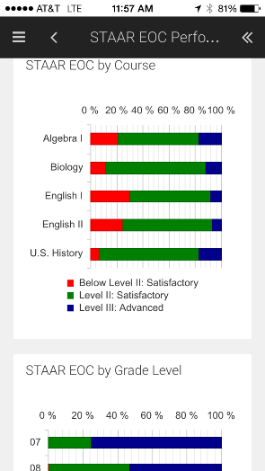
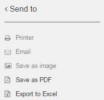

.. _features-charts-and-dashboards:

# Charts and Dashboards
## Dashboards

### Working with D3 Dashboards 

A dashboards is a collection of charts. Functional area dashboards contain charts related to the specific function. The only exception to this is the At a Glance dashboard in Favorites; this dashboard is specific to each user and may contain charts from various functional areas, based on user’s preferences.
***

#### Dashboard Selection
Dashboards are identifiable by the 3x3 matrix icon above. To navigate to a dashboard, click on Favorites or Chart Library. When navigating to a dashboard in the Chart Library, the user first selects the functional area and then selects a specific folder, if multiple folders exist. Click the desired dashboard to select it and view it.

##### Switching between Dashboard and Chart Selection
Once a dashboard is selected, it becomes the scope of actions in the Action menu (see below). When a chart within the dashboard is clicked, it becomes the selected chart and scope of actions in the Action menu is switched from the dashboard as a whole to the selected chart - this is indicated by the red boundary drawn around the selected chart. To undo selection of a chart and return scope back to all charts in the dashboard, click the selected chart again.
***

#### Dashboard Layout
Dashboards present multiple charts in a grid of columns and rows. Generally, a chart occupies a single cell (intersection of column and row); however, some charts use 2 columns on a single row – this is done selectively to enhance visualization of data presented in certain charts. Note the top right and bottom left charts in the figure below to see multi-cell charts.
Dashboard layout is completely dynamic: as more charts are added to (or removed from) a dashboard, the layout is expanded or collapsed, depending on the number of charts. 


##### Handheld Devices
On hand-held devices, charts are displayed in a single column. Each chart occupies the device’s screen entirely. Scroll down or up to view additional charts.


***

#### Customizing Dashboard Layout
Dashboard layout is also configurable by the user: users can modify the layout of dashboard by moving charts around in the grid  and defining single or multi-cell housing for each chart.
***

### Dashboard Actions
Users can perform various actions on dashboards. These actions are available from the Actions Menu which can be activated by clicking the double left arrow icon, located at the top right of the D3 screen. Actions applicable to the dashboard as a whole are enabled as shown below; disabled actions are reserved for selected charts only (to learn more about these, see Working with D3 Charts section).


```eval_rst
.. tip ::

    **Hiding Actions Menu:** When the Action Menu is opened, the icon is switched to a double right arrow icon; to close the Action menu, click the double right arrow icon

```

##### Send to
The Send to action allows the user to share, save, print or export the dashboard.




