```eval_rst
.. _features-data-explorer:
```
# Data Explorer

## Introduction

D3 is able to provide results for millions of rows of data in real-time because it leverages an underlying technology called OLAP, or On-Line Analytical Processing. OLAP associates each item of information with the various categories that the information can be grouped by. For example, student daily attendance is a data item, which can be grouped by day, week, month, school, grade level, and many other categories. The Data Explorer provides a convenient way to explore data items across their many available categorizations. This can result in understanding the data more clearly which may help in identifying issues, realizing opportunities and, in general, aide the decision making process.

```eval_rst
.. seealso:: 
   :ref:`technical-olap-concepts`
```

With the Data Explorer, you can drill-down on and slice your data values interactively to observe statistical trends and relationships between data. Results of your selections are shown visually in charts. Your exploration steps are always preserved on-screen. Each action you take results in a new chart drawn below the previous one. You can explore to an unlimited number of levels. Common actions are listed at the bottom of your exploration, and all available actions can be accessed from the sidebar.

The Data Explorer allows you to dissect information in various ways to better understand the underlying components of data. This  can lead to inferences that can be made from comparisons, contrasts, trends, and other investigative techniques.
The systematic dissection of a chart allows the user to start with aggregated data for the entire district or a campus and apply successive explore actions to drill down, categorize, sub-categorize, and/or filter specific components of a chart. These steps can proceed indefinitely until the user arrives at data attributed to individual classrooms, teachers, or students. 

Data Explorer capabilities include:

* Work with multiple data items to perform cross-functional analysis
* Categorize and sub-categorize data values
* Filter on specific category items
* Disaggregate to drill-down on areas of interest
* Apply top-n filters
* Change the display type of charts, or switch to data view
* Augment results with additional information fields
* Export, save, and share your data explorations
* Revisit recent explorations
* Create a new chart in the library using the results of a data exploration

Learn more about these capabilities in the remainder of this section.

## How to Explore

There are three ways to initiate a data exploration in D3:

1. From an Existing Chart
2. From an Existing Exploration
3. Start a New Exploration

### Explore an Existing Chart

When a user initiates a chart Explore action, D3 instantly begins the exploration and automatically recreates the exploration steps to reproduce the selected chart information.

```eval_rst
.. _how-do-i-explore-existing-chart:
```
<div class="task-title">
How do I apply explore a chart?
</div>

1.  <span class="task-item">Navigate to the desired chart</span>

    If the chart is in a dashboard, select it first.

2.  <span class="task-item">Click the Explore command in the Actions section of the sidebar.</span>

    The main D3 content area is redrawn to present the exploration steps to reproduce the chart data.

3.  <span class="task-item">Begin exploring by selecting actions such as filter, categorize, or disaggregate on n chart in the display action.</span>

    New charts are recreated and presented in the Explorer display area as a result of successive actions.

### Open an Existing Exploration

Data Explorer allows you save to an exploration for future use. It also automatically retains your most recent explorations in case you want to revisit them.

To access the existing explorations, open the main menu and select the tab with the cube icon. Saved explorations and recent explorations are listed in the pull-out menu area. Click one to launch it.

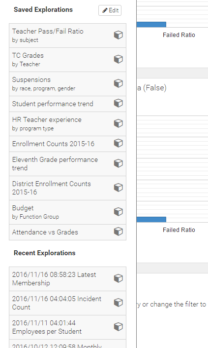

### Start a New Exploration

You can initiate a new exploration by clicking the `Start Exploring` button. Open the main menu and select the tab with the cube icon. The button is at the top of the pull-out menu area.

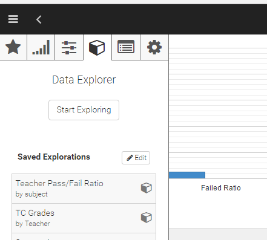

When starting a new exploration, the first thing to do is to select one or more values to work with:

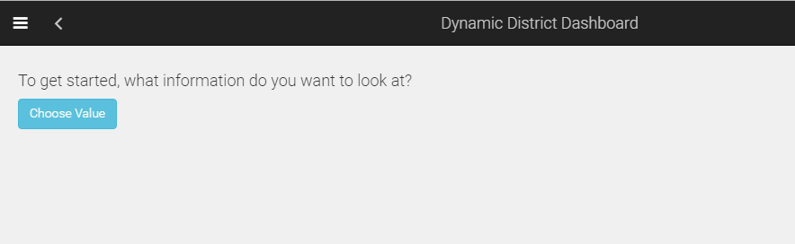


## Walkthrough

When starting from an existing chart or exploration, a series of levels will be displayed immediately. Each level represents a step applied to one of more specific kinds of data values.

Let's take a look at the "ADA to Date by Campus" chart that's included on the Attendance dashboard:

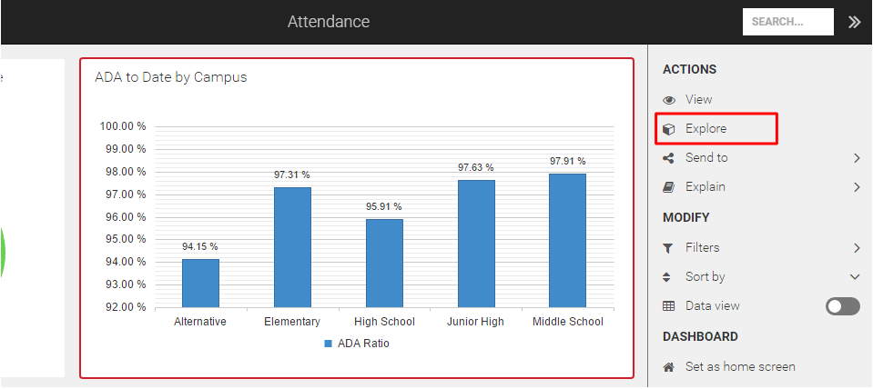
 
Clicking the `Explore' command from the sidebar launches Data Explorer as follows:

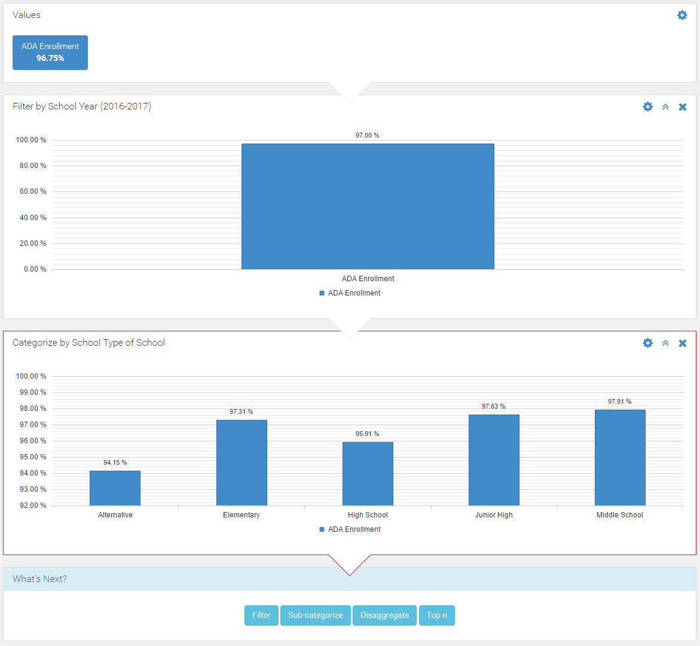

Notice that the Data Explorer shows that three steps were used to produce the chart data. We call these steps exploration levels. This is a fairly simply exploration. Some of our charts may show that several steps are used to produce the results.

### The Values Level 

The first level is always the Values level. An exploration always begins with choosing the data values to be explored. It is possible to change this at any time, and even add additional data items, by clicking on the gear icon. You can also click the level first, which will highlight it with a red border, and then click `Edit` from the sidebar. 

Let's see what happens. In the image below, I've selected the Values level `(1)` and clicked on Edit in the sidebar `(2)`. Then I've hit the checkbox at the bottom of the displayed popup to enable multiple selections `(3)`. Finally, I've selected the Absences per Student box (4). 

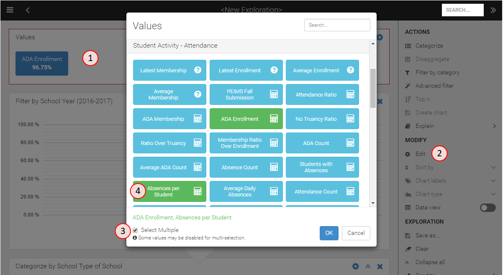

You can see that both the initially selected `ADA Enrollment` and the `Absences per Student` boxes are now both green. Let's click OK, and see our exploration get updated.

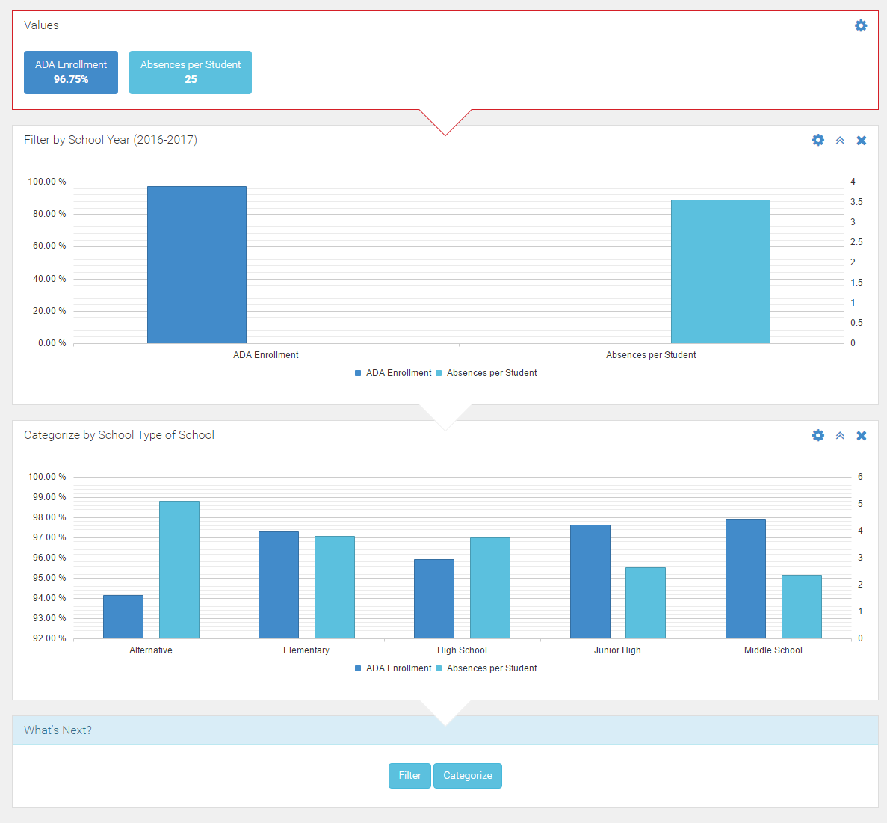

Let's now take a look at the other two levels in this exploration.

### The Filter Level

The second level applies a filter to only include data from the 2016-2017 school year. By default, values added to an exploration represent the summary of information globally in the data warehouse. It is very common to want to filter this to look at the current or preceding school year only.

I'll click the gear icon `(1)` on this level to open the filter popup, from which I can adjust the selected included school years. In this case, let's add the prior school year `(2)`.

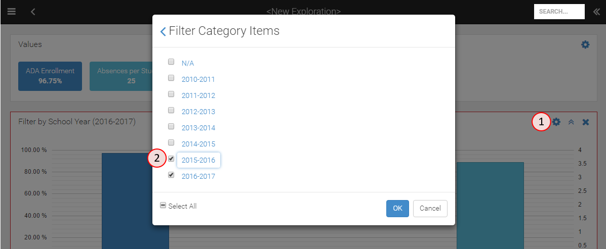

Notice at the bottom left is a `Select All` checkbox. It currently has a horizontal line in it, which means that some (but not all items are selected). You can click this box to toggle selection or all items or no items, which are shown as a tick sign in the box or an empty box respectively. Note that selecting no items is effectively the same as selecting all items, because no items is interpreted as not applying the filter.

You're not limited to working with the school year filter in this popup. Clicking the left arrow on the top left corner of this popup brings you to the list of all available filter criteria.

### The Category Level

The third level in this example applies a categorization to the data; in this case a chart is drawn with columns for the different kinds of campuses at the district. Formally, this is the known as the `School Type` category, belonging to the `School` grouping. Clicking the gear icon, opens the category popup, from which you can choose a different category. All our categories are contained in groups, which are collapsed by default. Click any group name to expand it. Because D3 has a lot of ways to categorize data, we only display the most commonly used ones by default. Click the "View all" link to switch the view to include all categories.

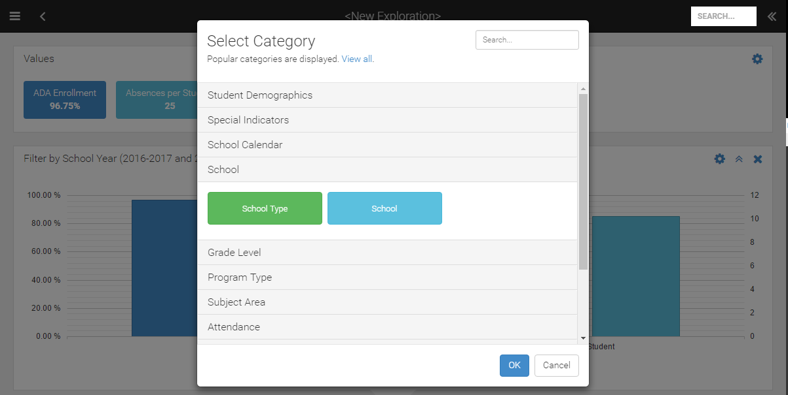

### Working with the Exploration

Notice that each level in the exploration include an automatically generated title that describes the applied action. Also, on the right side of each level are three icons. You're already familiar with the gear icon. The double-chevron point up will collapse the level by hiding the chart. For more complex explorations this can be particularly useful by minimizing the vertical space used by levels that you're not interested in looking at. Note that from the sidebar, there is also a command to expand or collapse all levels at once.

It's worth noting that both the filter and the category popups are "smart", meaning that they automatically exclude items that can't be used with the values you have selected for your exploration. They also both include search boxes to quickly locate items of interest.

At the bottom of the exploration is a box titled "What's Next" with buttons for the most popular actions. These commands are also available from the sidebar, but most users will find it more convenient to quickly build explorations by clicking these buttons instead.

It is also possible to work with multiple exploration paths at a time. It's easiest to show this by example. I will select the filter level `(1)`, then from the sidebar choose the Categorize command `(2)`. Note that in this case, I didn't select the Edit command, which would modify the existing level. Instead, I'm choose a new action to create. Finally, I select the `Grade Level` category `(3)`.

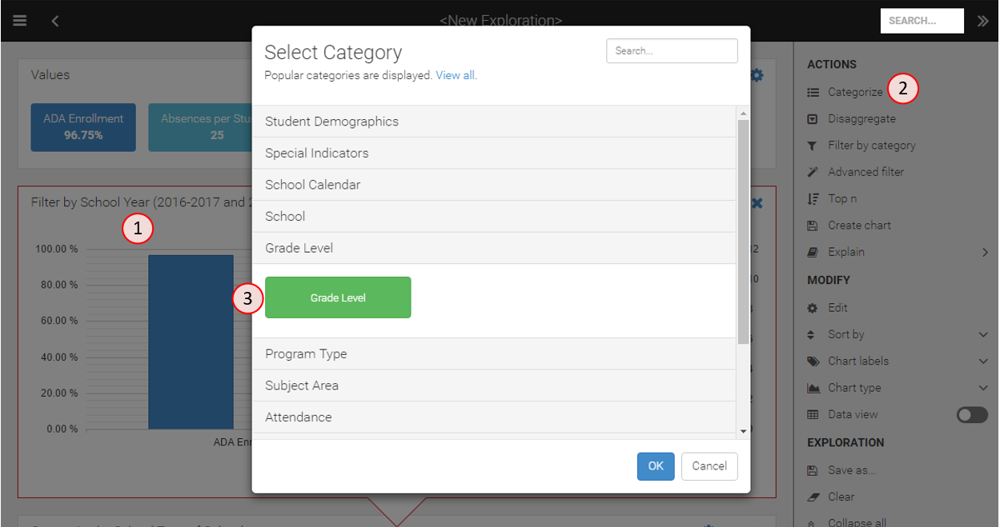

Clicking OK, closes the popup and updates the exploration to include a tabbed interface.

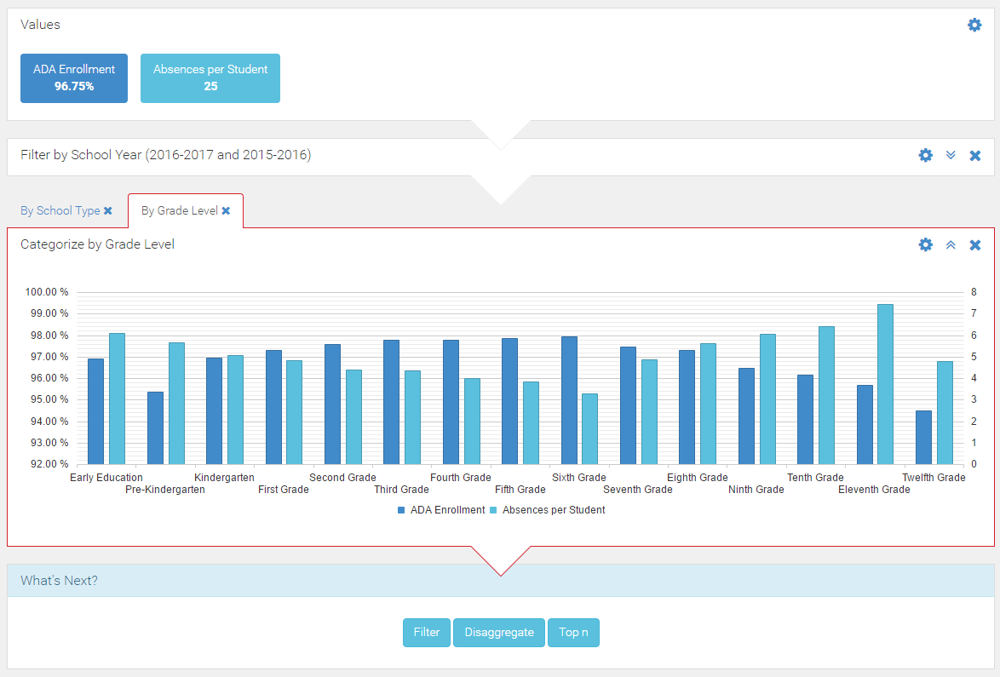

See how the existing School Type category below the filter is preserved, and the new grade level category is displayed. There's no technical limit on how many tabs you can add, although things will probably start to get confusing after 5 or so.

### Disaggregating

Disaggregation, or drilling-down, refers to the selection of an existing categorized item, and expanding the results by a new category. One way to accomplish this it to create a filter to select a single chart component, and then create a categorization on the results of the filter. There is a more convenient way to do this though, which has the added benefit of showing the results in a single step rather than two. To perform disaggregation, click a bar or line in a chart. This then automatically pops open a list of available categories to choose from. Select a category and click OK to see a new chart drawn showing the results of the selected item divided into columns by the new categorization. The item selected from the previous chart will be highlighted to show that it was selected for disaggregation.

To continue with our example, here's the results of clicking on the third grade columns and then selecting the `Race category:

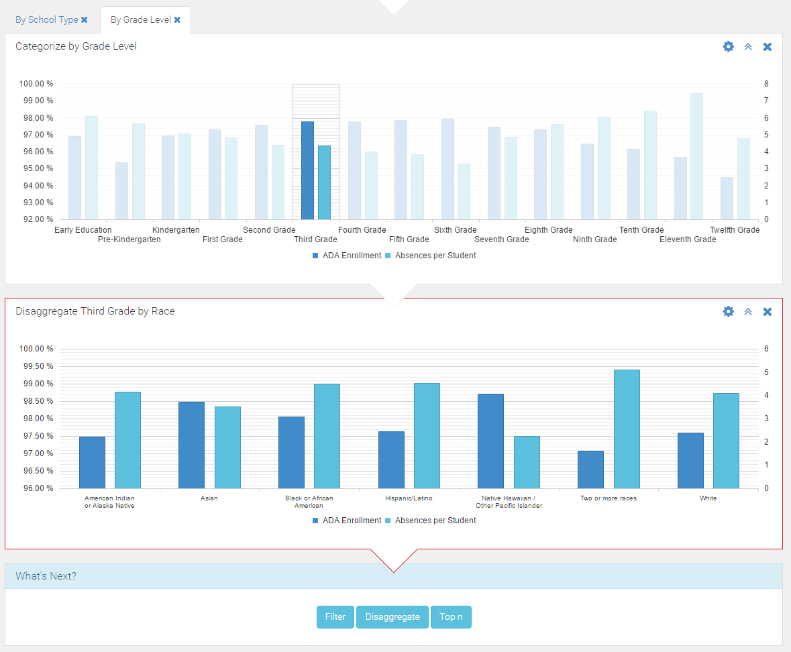

As a further convenience, the item that was disaggregated on can be changed by simply clicking a different column (or column group if multiple measures are being used as in this example).

The disaggregation process is unlimited and can proceed for as deep down the data hierarchies as desired by the user.


## Explorer Sidebar

Users can perform various actions on individual exploration levels or for the exploration as a whole. These actions are available from the sidebar, which is opened by clicking the double-left arrow icon, located at the top right of the application. Actions applicable to the selected chart are enabled as shown below. Explorer actions are grouped into four sections: Actions, Modify, Exploration, and Legend.

### Actions Section

Items in the Actions section apply to the selected exploration level.

#### Categorize / Sub-Categorize

As part of analyzing a chart, the user may wish to categorize the data by showing lower level components of the displayed data. For example, a chart representing data for the whole district may be categorized to show the data by campus types, campuses, or grade levels.

When the user clicks on the Categorize action, a list of popular categories applicable to the exploration values, appears. The user may select any of the default categories or click View All to select other categories. The available categories are based on the functional area context of the chart being categorized. For instance, an academics functional area chart will have academics type categories available for selection while a finance functional area chart will include only finance type categories.

When a categorization has already been applied to the exploration, this action displays "Sub-Categorize" instead. After a sub-categorization has been applied, this action is then disabled from further use because charts can only be categorized to two levels.  

#### Disaggregate

Due to the nature of how disaggregation works, it is intended to be activated by selecting a bar from an existing chart, which subsequently displays available categories to choose from. When the Disaggregate action is selected from the sidebar, a helpful message is displayed explaining how to use the disaggregation action. 

Unlike categorization, disaggregation can be repeated an unlimited number of times.

#### Filter by Category

The Filter by Category action allows the user to include or exclude specific data categories. This action helps focus user analysis on data of interest. For example, a user may want to focus the ADA analysis on high school campuses or on just 9th and 10th graders.

Initially, when the user clicks Filter by Category, a list of popular categories applicable to the current chart is presented. The user may select any one of the default categories or click on View All to select other available and applicable categories. The available categories are based on the functional area context of the chart being categorized. For instance, an academics functional area chart will have academics type categories available for selection while a finance functional area chart will include only finance type categories.

Once a category is selected, values within the category are displayed. Each can be selected or unselected to setup the desired filter.

#### Advanced Filter

The Advanced Filter is useful for more complex filtering scenarios, which involve filtering on other value items rather than on category items.

It is easiest to understand the Advanced Filter with an example. In the Walkthrough section, an exploration was created from the "ADA to Date by Campus" chart. Let's say we now want to investigate the exploration results for the subset of students that had at least 10 absences in the previous school year.

Begin by opening the Advanced Filter.

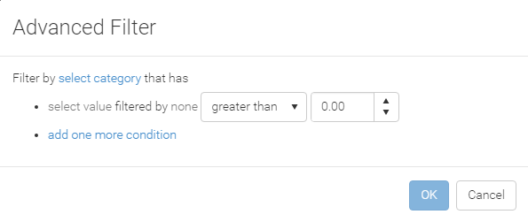

Our exploration is currently working with ADA Enrollment values and we want to now apply a filter using Student Absences. The first step in using Advanced Filter is to identify through which category the two sets of values should be connected.

When analyzing student-related information, the "Student" category should be selected from the "Student Demographics" group.

```eval_rst
.. note:: 
   To decide which category to choose in other situations, it is helpful to understand the :ref:`OLAP concepts<technical-olap-concepts>` used by D3. When using the Advanced Filter, you are connecting measures from two fact tables. The category to be selected is the common dimension shared by those tables that represents the main subject of both measures. 
```

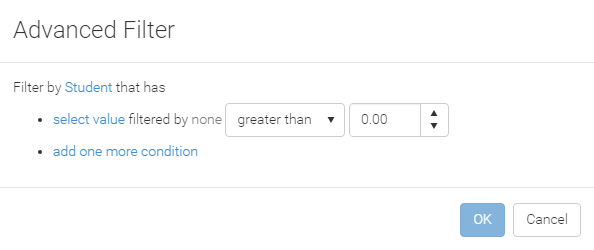

Once the category is selected, you can see that the "select value" link is now enabled. Click this link and choose "Absence Count" from the "Student Activity - Attendance" group. We want to count only absences from the previous school, so click on "none" and select the "School Year" category from the "School Calendar" group, then place a check mark next to the applicable school year. Finally, enter the value 9 to define the expression as "greater than 9", which satisfies our requirement for students with at least 10 absences.

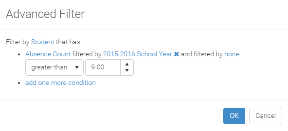

Notice that the Advanced Filter popup supports extending the filter criteria to support more complex expressions. You can add additional criteria to the "Absences Count" value, or add additional conditions.

It's interesting to see how the impact of applying this advanced filter to our analysis:

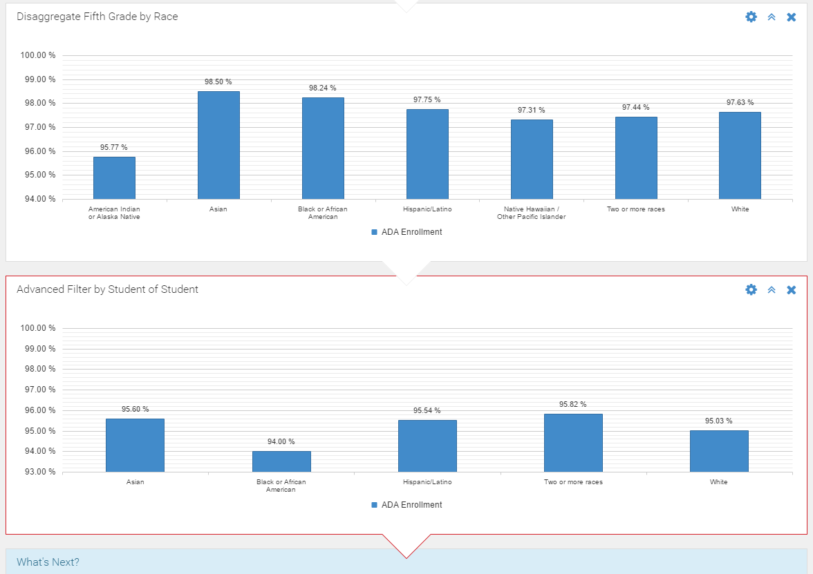

#### Top N

The "Top n" action allows the user to restrict a chart to show only a specified number of top or bottom values of data. This is useful when the user wants to identify the highest or lowest values in a chart so that further analysis can be focused just on those. Here the “n” represents the number of top or bottom values to include on a chart; the user is prompted to provide the desired count "n". 

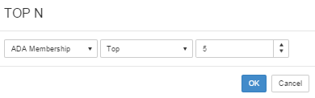

#### Create Chart
```eval_rst
Select any exploration level, then choose "Create chart" from the Actions in the sidebar to automatically add the chart to your :ref:`My Items<features-my-items>` folder in the Chart Library. You are prompted to provide the name of the chart. The title of the exploration level is pre-filled if you wish to use it. 
```

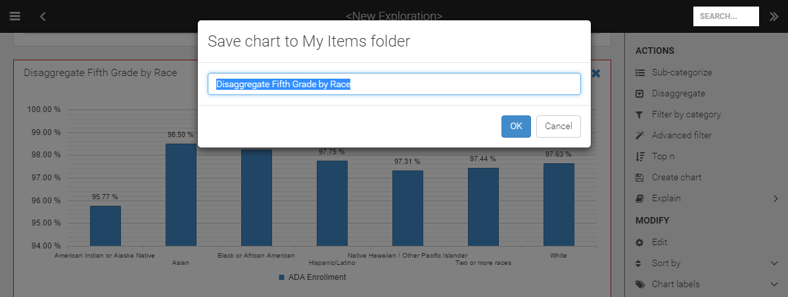

#### Explain

The Explain action displays information about the selected exploration level. The Description section includes a human-readable interpretation of the chart settings, and the Configuration section includes the values, categories, and filters applied to the current chart. For each value, statistical information is also provided.

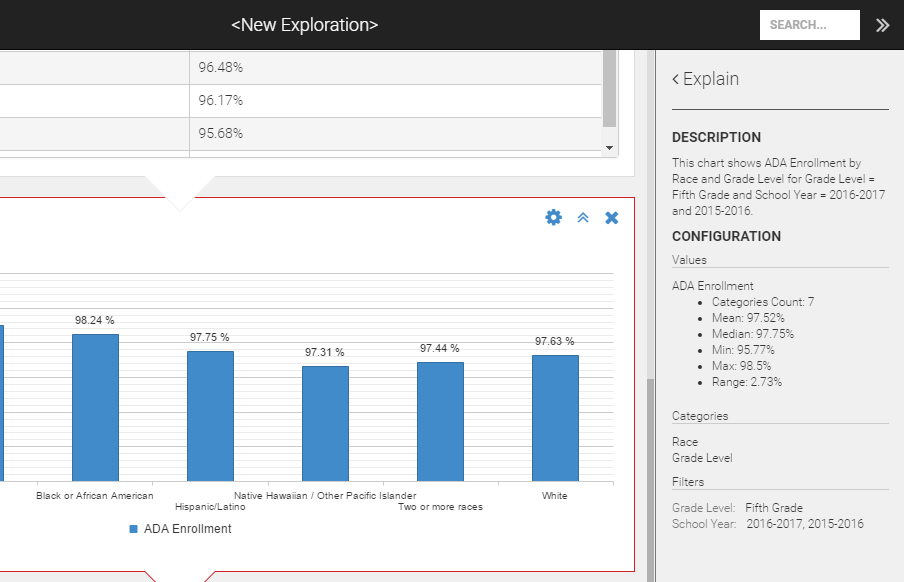

Click the Explain heading to return to the main sidebar display.

### Modify Section

Items in the Modify section apply to the selected exploration level.

#### Edit

The Edit option within the Modify section of the sidebar allows the user to change the configuration of the selected level. For example, if the selected level is categorized by Campus Type, the user can click Edit to change this to Campus; this causes the current chart to be redrawn showing values for each campus, instead of each campus type. For another example, consider the current chart is showing top 5 campuses for ADA; the user can change this to bottom 5 or 3 by clicking on Edit then changing the "Top n" settings.

#### Sort By

The "Sort by" option is used to adjust the sort order of displayed values in the chart. Click the down arrow on the right-side to expand into view the available sort options. The initial sort order is Default, which uses an internal determination to provide the most suitable sort order for chart items. Changing the sort order to Value will sort the items in descending order by their value, and changing to Category will sort the items alphabetically by their name. 

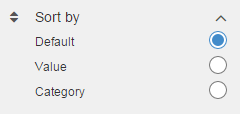

#### Chart Labels

The "Chart labels" option allows the user to control whether labels are shown in the chart. Click the down arrow on the right-side to expand into view the available chart label options. The default selection is "Auto", which shows chart labels when there is sufficient space to display them without making the chart too small.  The user can override the automatic behavior by selecting either "On" or "Off".

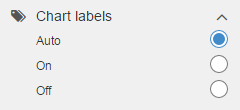

#### Chart Type

The "Chart type" option is used to customize the type of chart displayed for the selected exploration level. The default chart type is Column, but there are several other choices available that can provide a better display of data as needed.

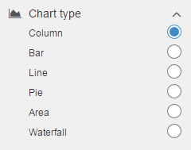

#### Data View

The "Data view" option is a toggle switch that changes the view of the selected level from a chart to a grid view. This allows the user to see the underlying data of the chart in tabular form.

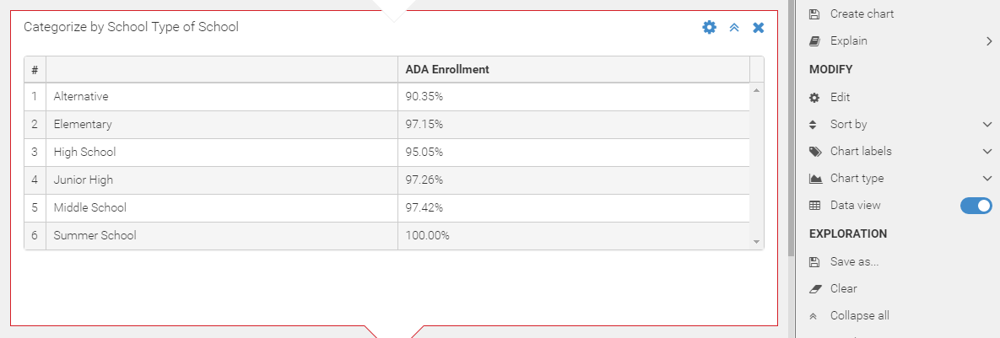

In some cases, when data view is enabled, an additional option called "Show additional columns" appears in the sidebar immediately below. Click the down arrow on the right-side to expand this option to select one or more additional fields to include in the view results. The available columns in the list are dynamically determined based on categorization of the current level. If the "Show additional columns" is not available in data view, it is because there are no additional columns available to show for the selected category.

This additional columns feature is particularly useful when you drill-down to individual students.


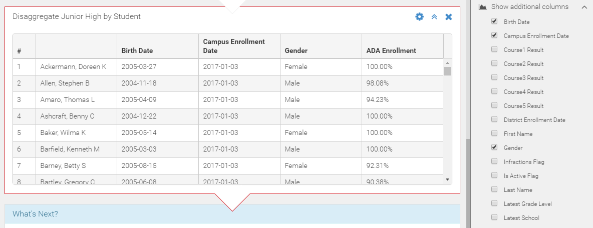

### Exploration Section

Items in the Exploration section apply to the exploration as a whole.

#### Save As

The "Save As" option allows users to save all exploration steps and charts so they can resume the exploration at a later time. The user is prompted to enter a name for the current exploration and then press OK. The saved exploration will then appear in the Explore tab of main menu panel.

#### Clear

The Clear option resets the current exploration to the initial sate. 

To undo the Clear action, click on the D3 back arrow button (located in the top left corner of the D3 screen, just to the right of the navigation menu icon).

#### Expand / Collapse All

This option enables collapsing or expanding all explorations at once. Here is an exploration with all levels collapsed:

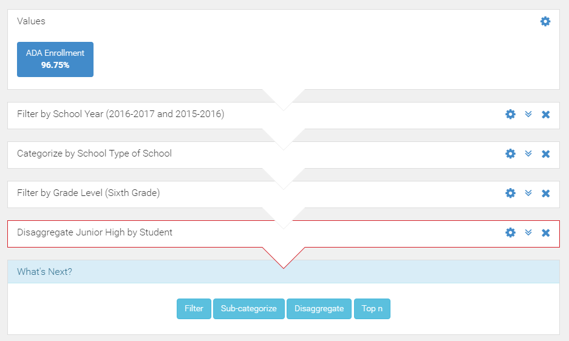

#### Send To

The "Send to" option expand a sub-menu with various options for saving and sharing the exploration.

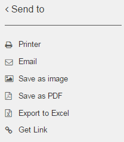

* **Printer**: Allows the user to print on-screen the visual representation of the current exploration. The user is presented with the Print dialogue box to select the printer. 

* **Email**: Allows the user to email the current exploration. This invokes a dialog box that asks the user to enter one or more email addresses, a subject line, and an optional message. The type of attachment defaults to an image, but can be changed to a PDF or an Excel spreadsheet. Upon clicking Submit, the email is sent with the selected exploration attached in the selected format. Note that the image and PDF options will attach a visual representation of the exploration, whereas the Excel option attaches the information as tabular data.

* **Save as image**: Allows the user to save the current exploration as an image. The file is downloaded as "Data Exploration.png". This format is most useful when the image needs to be inserted in documents.

* **Save as PDF**: Allows the user to save the current exploration as a PDF document. The file is downloaded as "Data Exploration.pdf".

* **Export to Excel**: Selecting this option will present the choice of exporting the entire exploration or just the currently selected level. After choosing the applicable option, the Excel file is saved.

*  **Get link**: Provides a URL link that can be saved or shared with other authorized users. When an authorized user clicks on the link, the user is navigated to the exploration automatically.

```eval_rst
.. note::
   When another user accesses a shared exploration link, a copy of the exploration is created for that user. This ensures that changes made by the other user do not affect your own exploration, and changes you make after sharing do not impact the those you shared the link to.
```

### Legend Section

```eval_rst
The legend section displays the color coding of items in the selected chart. For more information, see the :ref:`legend documentation<features-chart-legend>` for the chart library.

```