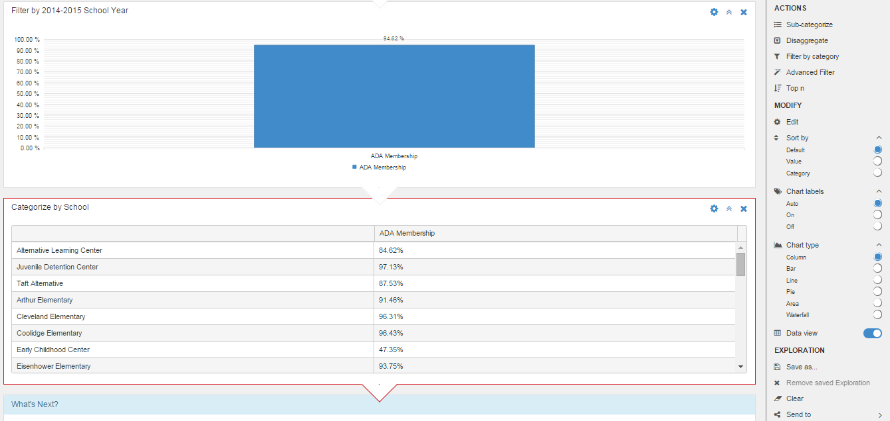

```eval_rst
.. _features-data-explorer:
```

# Data Explorer


#### Explore 
As noted earlier, D3 charts are initially presented at the highest possible aggregation of data. Analysis of charts often requires “drill down” operations that can allow users to observe statistical trends, and relationships of data. This can result in understanding the data more clearly which may help in identifying issues, realizing opportunities and, in general, aide the decision making process. 

#### Reasons to Explore
The Explore action is used to systematically dissect a selected chart in various ways to better understand the underlying components of data; this can lead to inferences that can be made from comparisons, contrasts, trends, and other investigative techniques.
The systematic dissection of a chart allows the user to start with aggregated data for the entire district or a campus and apply successive explore actions to drill down, categorize, sub-categorize, and/or filter specific components of a chart. These steps can proceed indefinitely until the user arrives at data attributed to individual classrooms, teachers, or students. 
In conclusion, Explore allows the user to observe variations of data at the lowest possible levels (for instance, individual student EOC performance); this in turn may allow for further analysis to determine root causes of these differences resulting in action plans to remedy possible problems.


#### D3 Automatic Explore Steps
When a user initiates a chart Explore action, D3 instantly begins the exploration and automatically applies filters to exclude data assumed to be out of scope for the exploration. For instance, D3 will apply a school year filter to include only the current school year on an ADA chart. To undo this and include all school years, the user can remove the applied filters (see Edit Explore action below).


#### Actions Section
When an Explore operation is started, additional actions are added to the Actions menu. These new actions allow the user to perform successive tasks on desired charts to aide in analysis; these action tasks include: Categorize, Disaggregate, Filter by Category, Advanced Filter, and Top n.


##### Categorize
As part of analyzing a chart, the user may wish to categorize the data by showing lower level components of the displayed data. For example, a chart representing data for the whole district may be categorized to show the data by campus types, campuses, or grade levels. 
When the user clicks on the Categorize action, a list of default or popular categories, applicable to the char, appears. The user may select any of the default categories or click View All to select other categories. The available categories are based on the functional area context of the chart being categorized. For instance, an academics functional area chart will have academics type categories available for selection while a finance functional area chart will include only finance type categories.


Multiple categorizations are allowed on the same chart. Multiple categorizations are presented in a tabbed control that allows the user to alternate views to see each categorization. Each categorization results in a new chart showing the corresponding categories selected.  The user may categorize each resulting chart to show yet lower levels of data components. The categorization process is unlimited and can proceed as far down the hierarchy of data as the user desires. Below are samples of results on the Categorize action, including multiple charts shown in a tabbed control.


Categorize Example showing tabbed Categorizations – by Campus Type


Categorize Example showing tabbed Categorizations – by Grade Level


2nd Level Categorize Example – Campuses for each Campus Type


2nd Level Categorize Example – Campuses for each Grade Level

##### Sub-Categorize
Charts showing Categorized data may be sub-categorized further. This allows the user to show sub-groups of the categorized data. Similar to Categorize, the user is prompted to select a sub-category; see  Category Selection figure above.
See example below where ADA for the district was first categorized by grade level; then, the resulting grade level chart is sub-categorized by race/ethnicity. The overall analysis presented in the example allows the user to see what are the ADA differences between the various grade levels and then examine the ADA differences between the various student ethnic groups for each of the grade levels.


##### Disaggregate
The Disaggregate action is a powerful analysis tool to “drill down” on a specific chart component. The Disaggregate action differs from Categorize in that Disaggregate works only on a specific data value while Categorize works on all data values of the chart. 
When the Disaggregate action is clicked, the user is prompted to select a Disaggregation category. See Category Selection figure above.
The Disaggregation process is unlimited and can proceed for as deep down the data hierarchies as desired by the user. Below is an example of Disaggregate action performed on the 9th Grade Level data in the ADA by Grade Level chart.


##### Filter by Category
The Filter by Category action allows the user to filter out/in specific data categories. This action helps focus user analysis on data of interest. For example, a user may want to focus the ADA analysis on High school campuses or on just 9th and 10th graders.
Initially, when the user clicks Filter by Category, a list of default or popular categories applicable to the current chart is presented. The user may select any one of the default categories or click on View All to select other available and applicable categories. The available categories are based on the functional area context of the chart being categorized. For instance, an academics functional area chart will have academics type categories available for selection while a finance functional area chart will include only finance type categories.
The user may select Filter by Category from any chart during the Explore process. This includes Categorize, Sub-Categorize, and Disaggregate.

##### Advanced Filter 
The Advance Filter action allows the user to select cross functional categories. This action widens the scope of categorization and sub-categorization so that a user may categorize academic type charts by finance or human resource type categories. 
The Advance Filter action involves tow prompts that require user selection. First the user must select a Category of data to filter on. Next, the user provides a condition for the selected category. The condition may be a specific value or an inequality threshold (less than or greater than). The user may specify more than one category, each with its own specified condition.


##### Top n
The Top n action allows the user to restrict a chart to show only a specified number of top or bottom values of data. This is useful when the user wants to identify the highest or lowest values in a chart so that further analysis can be focused just on those. Here the “n” represents the number of top or bottom values to include on a chart; the user is prompted to provide the desired count “n”.


#### Modify
The Explore - Modify section within the Explore actions menu provides the ability to change the view presented for each Explore chart

##### Edit
The Edit action within the Modify section of Explore allows the user to change the current chart’s categorization, sub-categorization, disaggregation, Filter, Advance Filter, or Top n settings. For example if the current chart is categorized by campus type, the user can click Edit to change this to campuses; this causes the current chart to be redrawn showing values for each campus, instead of each campus type. For another example, consider the current chart is showing top 5 campuses for ADA; the user can change this to bottom 5 or 3 by clicking on Edit then changing the Top n settings (see Top n figure above).

##### Sort by
The Sort by action within the Modify section of Explore allows the user to set the sorting of displayed values in the chart. Initially, when an Explore chart is displayed as a result of an Explore action, the sort order is set to Default; in most cases, this is based on the logical ordering of the data items shown in the chart. 
For instance, an ADA column chart showing ADA % for all grade levels shows lowest to highest grade levels from left to right, regardless of the ADA %. To change the sort order to show highest to lowest ADA % from left to right, the user should click on the Sort by action, then select Value; to reverse this order and show lowest to highest ADA % from left to right, click on the Category Sort by option. See figure below for the Sort by options


##### Chart Labels
The Chart Labels action within the Modify section of Explore allows the user to hide or show labels of data values presented in a chart. By default, all D3 charts show labels to signify the data values of chart components. In column charts, labels are shown on top of each column; in pie charts, labels are displayed to the right of each pie slices; and so on. For a clearer view of a chart, especially in crowded ones that have many components, the user may elect to hide labels. To do this, the user clicks on the Off option of the Chart Labels action. To reinstate labels, the user simply clicks on the Default or On option.


##### Chart type
The Chart Type action within the Modify section of Explore allows the user to change the chart type. D3 features various chart types; the default chart type for explorations is column chart. However, for any selected chart within an Explore operation, the user may change the chart type for better display of data as needed. Below is a figure that shows the Chart Type options available in D3


##### Data View 
The Data View action within the Modify section of Explore allows the user to change the display from chart to data grid. This allows the user to see the underlying data of the chart in tabular form. Below is an example of changing from chart to data view of ADA % for each campus.


Exploring a chart allows the user to drill down to the student level. When the Data View is invoked showing student level information (list of individual students), the user can select additional data to view corresponding to each student in the list.


#### Exploration Section
The Exploration section allows the user to perform various actions on the current exploration as a whole. Users can save the exploration for later actions and analysis, they can clear the exploration to start over, or they can export the entire exploration.

##### Save As
The Save As action within the Exploration section of Explore allows users to save all exploration steps and charts so they can resume the exploration at a later time. 
When the user clicks on Save As, the user is prompted to enter a name for the current exploration and then press OK. This saves the exploration (with all steps/actions and resulting charts) in the D3 Explore section. To resume the saved exploration, the user should click on the Explore navigation panel option


##### Clear
The Clear action within the Exploration section of Explore allows users to clear the current exploration session. All steps/action and resulting chart are removed. 
To undo the Clear action, click on the D3 Back Arrow button (located in the top left corner of the D3 screen, just to the right of the navigation menu icon).


##### Send To
The Send To section allows the user to share, save, and perform other actions on the current exploration in its entirety.


###### Printer
The Send to Printer action allows the user to print the current exploration in its entirety with all steps and resulting charts. The user is presented with the Print dialogue box to select the printer

###### Email
The Send to Email  action allows the user to eMail the current exploration in its entirety with all steps and resulting charts. This invokes a dialogue box that asks the user to enter one or more eMail addresses, a subject line, and a message. Upon clicking Submit, the eMail is sent with the selected exploration as a jpg attachment

###### Save as image
The Sent to Save as image action allows the user to save the current exploration in its entirety with all steps and resulting charts as a jpg image to any drive attached to the user’s local device. The image can later be inserted in documents as needed for internal or external district/campus communications.

###### Save as PDF
The Send to Save as PDF action allows the user to save the current exploration in its entirety with all steps and resulting charts as a PDF document. The user is presented with the Save as dialogue box where the user can select the name of the desired PDF file as well as the drive and folder where to save the PDF file.

###### Export to Excel
The Send to Export to Excel action allows the user to export the data for the current exploration in its entirety with all steps and resulting charts to Excel. The data is saved into the first tab within the Excel file. When the user selects this action, the Excel file is created with a generic name and is downloaded to  the local device’s Downloads folder; the downloaded file is available in the bottom right of the screen for opening and saving into another folder and name based on user preference

###### Get link 
The Get Link action provides a URL link that can be saved or shared with other authorized users. When an authorized user clicks on the link, the user is navigated directly to the exploration automatically.


### Filters
D3 charts present information at the highest aggregation level possible for the role of the logged in user. Filters allow users to narrow the scope of the data presented in a specific chart by excluding certain categories of information.

#### Functional Area Filters
Each functional area has a specific set of filters applicable to the corresponding function. 


<div class="wy-table-responsive">
<table class="docutils">
    <thead>
        <tr>
            <th>Functional Area</th>
            <th>Filters</th>
        </tr>
    </thead>
    <tbody>
        <tr>
            <td rowspan="6">Academics</td>
            <td>Campus Type</td>
        </tr>
        <tr>
            <td>Campuses</td>
        </tr>
        <tr>
            <td>Grade Level</td>
        </tr>
        <tr>
            <td>Program Type</td>
        </tr>
        <tr>
            <td>Genders</td>
        </tr>
        <tr>
            <td>Race / Ethnicity</td>
        </tr>
        <tr>
            <td rowspan="8">Finance</td>
            <td>Financial Unit Group</td>
        </tr>
        <tr>
            <td>Financial Unit</td>
        </tr>
        <tr>
            <td>Function Group</td>
        </tr>
        <tr>
            <td>Function</td>
        </tr>
        <tr>
            <td>Object Groups</td>
        </tr>
        <tr>
            <td>Object</td>
        </tr>
        <tr>
            <td>Fund Category</td>
        </tr>
        <tr>
            <td>Fund</td>
        </tr>
    </tbody>
</table>
</div>
