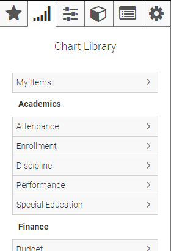
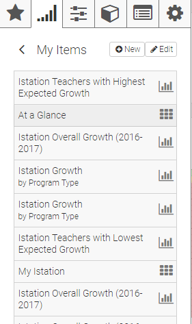
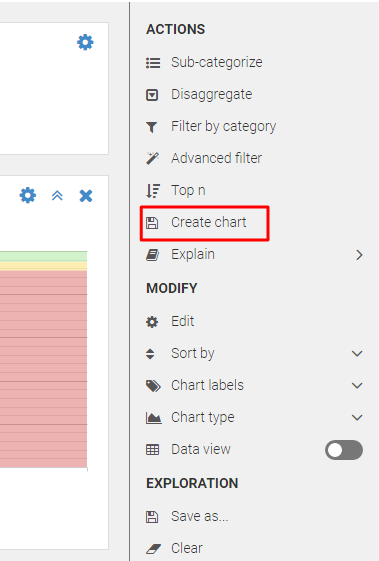
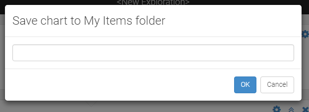
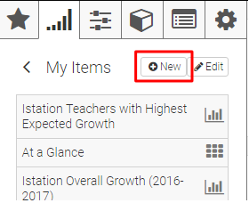
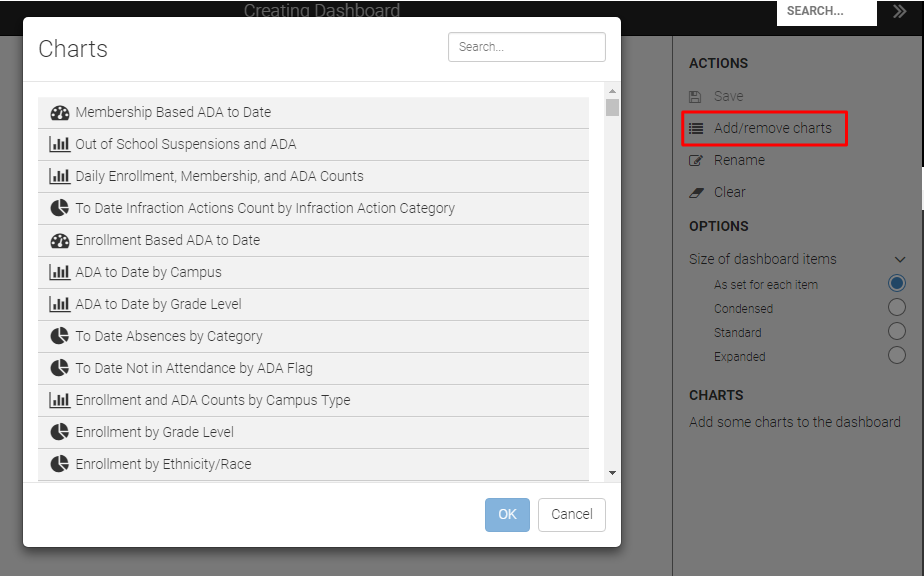

```eval_rst
.. _features-my-items:
```

# My Items

## Introduction

"My Items" is a special folder in the chart library. It is always shown as the first item in the library. The My Items folder is not displayed until you create your first personal item.



When you click the My Items folder, your list of personal items are displayed



There are several ways to create a personal item:

* Select an existing chart, explore it; create a personal chart
* Build a new exploration; create a personal chart
* Create a personal dashboard from existing charts

## Create a Personal Chart

Personal charts are created from the Data Explorer. You can either start from an existing chart and click Explore from the sidebar, or create a new exploration.

```eval_rst
.. seealso::
   :ref:`Learn more <features-data-explorer>` about working with Explorer.
```

If starting from an existing chart, you can make any changes to the exploration steps to customize the chart to your needs.

When ready to create a personal chart, select "Create chart" from the Actions section of the sidebar. By default, this creates a chart from the bottom level of the exploration, but you can also select a different exploration step to create a chart from that step instead.



You will then be prompted to provide a name for your chart. Choose something descriptive. The provided text will appear in your My Items folder:



## Create a Personal Dashboard

To create a new dashboard, click the "New" button above the "My Items" list.



The sidebar will automatically appear. It contains the tools and options you need to build your own dashboard.

You create a dashboard by adding existing personal or published chart to it. To get started click "Add/remove charts" in the Actions section of the sidebar. This presents a modal dialog of all charts available to you. Scroll down or use the search box to locate the first chart to add to your dashboard. Select it and click OK.

```eval_rst
.. tip::
   You can add multiple charts at once to your dashboard. Just select more than one item. Each selection is indicated with a green background. When all are selected, click OK.
```



TODO (functionality currently broken)

## Manage Your Items
