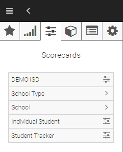

.. _features-scorecards:
# Working with D3 Scorecards
In general, scorecards present information that allow observation and tracking of various activities against organizational goals. 
D3 provides ISD, campus, student, and employee type metrics and a set of tools that optimize the presentation and analysis of scorecard information of each. D3 scorecards allow:

To access the scorecards tool, click on the navigation menu to display the navigation panel, hover over the menu item icons, then click on Scorecards; this displays the scorecard navigation panel as shown in the figure below.

D3 Scorecard Menu
## Types of Scorecards
At a minimum, D3 scorecards presents metrics from academics, finance, and human resource functional areas. Depending on implementation, data from other functional areas such as transportation and food services may be available. D3 presents scorecard information at various levels of aggregation and in different views designed to maximize the effectiveness of measurement of activities and tracking of progress towards goals:

Scorecard Types

## Scorecard Layout
A scorecard has a main view area where data is presented and an Actions panel to the right of the screen. See figure below for layout of a typical ISD scorecard.

Sample ISD Scorecard

### Scorecard View
D3 scorecards can show a variety of information depending on user needs. To streamline access of the various information, D3 organizes scorecard metrics into functional areas and folders (similar to the way dashboards and charts are organized) and presents this information in data grids designed to show multiple dimensions of data for multiple school terms or years.

#### Functional Area Selector
A functional selector across the top of the scorecard view allows the user to select the functional area of information to view; typical functional selectors are Education, Finance, and Human Resources

Scorecard Functional Selector

#### Folder Selector
A folder selector, located just below the functional selector, allows the user to examine specific areas of each functional area. Typical folders for the Academics functional area include Attendance, Enrollment, State Assessments, and others.

#### Data Grid
D3 scorecards present information in a data grid. In almost all cases, columns represent school years (the only exception to this is when viewing Campus Curriculum scorecard data). Typically, D3 displays scorecard data for the current school year followed by data for the 3 preceding school years. Rows contain various dimensions of data like absences, course grade, or number of discipline infractions.

#### ISD Scorecard
The ISD scorecard shows data aggregated for all campuses, locations, and departments of the district. Metrics like ADA, students per classroom, budget per student, and others are presented for the district as a whole. 

ISD scorecards are ideal for executive levels like superintendent, board members, and cabinet staff. Scorecard information and KPI’s provide a view of achievements and progress towards goals for the district as a whole. Using the Explore tool, these users can drill down into specific campus types, campuses, classrooms, and students as needed. Additionally, comparison tools allow users to view year over year changes as well as comparisons between campuses.

#### School Type Scorecard
The School Type scorecard is designed to show data for a particular type of campus, like High School or Elementary. Metrics and any defined KPIs like ADA, students per classroom, budget per student, and others are presented for the selected school type. 
School Type scorecards are ideal for executive and middle management levels like education directors and curriculum and instruction staff. The scorecard information allows these users to view achievements and progress towards goals for all schools of a specific school type. The Explore tool is available for these users to drill down into specific campuses, classrooms, and students as needed. Additionally, comparison tools allow the user to compare year over year results and view differentials.
At a minimum, School Type scorecards include academics, finance, and human resource data. Contingent on implementation, other data such as transportation and food services may be available.

#### School Scorecard
The School scorecard is designed to show data for a particular campus. KPIs and metrics like ADA, students per classroom, budget per student, and many others can be defined and setup for each school.
School scorecards are ideal for campus administrators and executive and middle management levels like education directors and curriculum and instruction staff. The scorecard information allows these users to view achievements and progress towards goals for all schools of a specific school type. The Explore tool is available for these users to drill down into specific campuses, classrooms, and students as needed. Additionally, comparison tools allow the user to compare year over year results and view differentials.
At a minimum, School scorecards include academics, finance, and human resource data. Depending on implementation, other data such as transportation and food services may be available.

#### Student Scorecard
The Student scorecard is designed to show data for a specific student. Student scorecards are ideal for campus administrators, assistant principals, and teachers. The Student scorecard information allows these users to view student metrics such as number and type of absences, achievements on state assessments and classroom grades, any discipline issues, and class schedule. The Explore tool is available for these users to drill down into specific data items. Additionally, comparison tools allow the user to compare year over year changes as well as contrasts of student metrics with campus and district averages

## Scorecard Actions
Similar to dashboards and charts, D3 scorecards are dynamic and allow user interaction. Various tools allow the user to work with scorecards as a whole as well as analyze individual data items or metrics displayed within each data grid of each scorecard. To interact with scorecards, users can click on the Actions menu; this exposes a set of actions as shown in the figure below:

Scorecard Actions Menu

### Explore
D3 scorecards allow users to analyze every metric or value reported. This is done using the Explore action in the Scorecard Actions menu. The Explore action for Scorecards works exactly the same way as it does for charts. 

### Modify
The Modify section of the Scorecard Actions menu allow the user to review year over year differences in the reported data as well as the ability to compare metrics with other campuses or campus types, depending on the type of scorecard selected.

#### Year over Year
For year over year comparisons, users have the flexibility of seeing the differences as percent values or as reported.

Scorecard Modify Actions

Below is a diagram of a scorecard with year over year selected; note the differences shaded in blue.

To show the differences as percent, click the Show as percentage option in the Modify Action menu section.

#### Compare To
The Compare To option allows the user to compare information in the scorecard for the selected campus or campus type to the district average, other campuses, or other campus types. For instance, if the user is reviewing scorecard information for ABC campus, the user can compare this information to the scorecard information reported for XYZ campus. Similarly, if the user is reviewing scorecard information for High School campuses over all, the user can compare this information to the scorecard information reported for Elementary campuses.
Below is a diagram that shows Compare To between Junior High and High School campus types:

### KPI 
KPI’s provide a mechanism to view progress towards goals. The progress indicator uses a color coded box drawn around each KPI metric that reflect status of the KPI as follows:

KPI Indicator Colors

The figure below shows two KPIs: Average Section Enrollment and ADA Enrollment. Note that for both KPI’s, the statuses vary based on reported values for each school year.

### Conditions for KPI Status
Exceeding a Maximum threshold or falling short of a Minimum threshold mean the goal is not met and the KPI indicator color or status is red.
A yellow status indicator color occurs when the current value exceeds the Minimum without reaching the stated goal or when the current value falls short of a Maximum without reaching the goal. 
To achieve green status, the current value must exceed the goal when a Minimum is defined or it must fall short of the goal when a Maximum is defined.

### KPI Information 
Information about a specific KPI is available in the Actions menu for the selected scorecard KPI. The information displayed includes: 

### KPI Setup
Users can setup KPI’s on any scorecard metric. In order to setup a KPI, some thoughts need to be given as to what the stated goal for the given KPI and whether measurement of KPI status is based on exceeding a Minimum threshold or ensuring a Maximum threshold is not reached.

