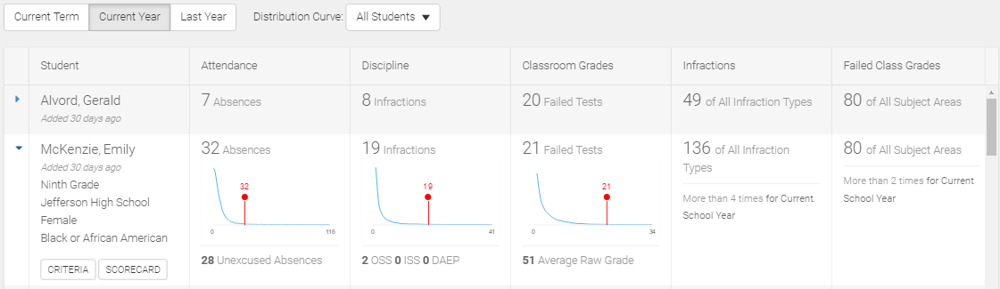

```eval_rst
.. _features-watchlists:
```

# Watch Lists

## Introduction

Watch lists enable tracking of student cohorts according to monitoring requirements.

Inclusion in the watch list can be managed by manually adding or removing students, or by specifying a criteria to be met for inclusion.

Once created, a watch list is used to view key metrics of included students, and provides one-click access to student details via a link to the student's scorecard.

A user can create many watch lists to support various needs through a wizard-style series of steps. Administrators can also publish watch lists to other users.

D3 supports the creation of three kinds of watch list:

* **Static**: Manually add or remove students from the watch list.
* **Dynamic**: Define search criteria for the watch list. Students get added to, or removed from, the watch list automatically.
* **Point-Based**: Define search criteria for the watch list and assign points to one or more search criteria.

Watch list history is supported to show when students were added or removed. It is also possible to create a snapshot of a dynamic watch list to save as a new static watch list.

```eval_rst 
.. note::
   If configured for your organization, it can also be used to track teachers or other entities.
```

## Managing Watch Lists

To access the watch list functionality, click the main menu icon, and then the 5th tab (identified by a boxed-in item list icon).


From the menu bar, you can create a new watch list, and select an existing watch list to view it. You can also click the edit button to modify or delete an existing watch list.

```eval_rst
.. _watchlist-create:
```

## Create a Watch List

### Wizard Steps

The steps in the create watch list wizard depend on the type of watch list being created. Some steps are common to all watch lists. Each step includes a `Next` button to proceed through the wizard.

This section describes the steps common to all watch list types. The following sections provide additional details for specific to each kind of watch list.

#### Select Template Step

All organizations are setup with a student-based watch list template. If other templates are configured, the initial wizard step is to select the template:


If you don't see this step, it is because only the student template is available for your organization.

#### Watch List Type

Next, the type of watch list is chosen:


#### Select Students / Criteria Step

The next one or two steps are for building the watch list criteria, which will vary depending on the type of watch list that was selected. For a static watch list the step title is Select Students and for dynamic watch lists it is Select Criteria. The point-based dynamic watch list includes an additional step called Point Assignments.

The selection of criteria works similar for all watch list types. Related criteria are grouped together. By default, the first section is expanded. Click any other section to expand it, as shown below.


Each criteria item consists of multiple fields of information. The available fields will differ depending on the criteria behavior, but most begin with a dropdown to choose a specific selection for the item, a context that the criteria is applied to, a condition to filter the results, and if applicable a plus icon to add an additional criteria selections.

For example, in the image above, the Daily Attendance Type has the following configuration:

* A dropdown to choose a specific attendance type (or leave the default option of all attendance types)
* A context to apply the condition criteria to, which has an initial selection Default School Year
* A comparison dropdown, which is More Than by default
* A text box for entering the comparison value (e.g. 1, means more than 1)

It may not be obvious at first, but there is quite a bit of flexibility in how you create the watch list criteria. Using the Daily Attendance Type as an example, let's review some capabilities.

The image below show a very simply criteria to identify students with more than 2 excused absences in the current school year:


But what if we wanted to identify students with either excused absences or excused tardies? Just click the attendance type selection box again, and select another item to add it:


How about extending this to also specify that you want to only include students that also had more than 1 unexcused absence in the current school year. Just click the plus icon to add another set to the Daily Attendance Type area, and specify your configuration:


Notice at the top, there is a summary of the criteria setup so far. As a quick way of removing a criteria, select one of these boxes then click the *X* that appears inside the box.

There is no limit to the number of criteria you can specify for a watch list.

#### Select Columns Step

Next, the columns to be shown in the watch list results are selected. The available options will depend on the watch list type, as well as the criteria selected for the watch list. The Select Columns step has a top section that provides control over standard columns show in the results, and the bottom section is for selecting additional columns from those specified as criteria for the watch list. Static watch lists do not have the bottom section.

The following image shows that top section for configuring the standard columns:


By default, all standard columns are displayed in the results, but each can be removed via the toggle switch.

Each of the standard columns in watch list results include a distribution curve chart that indicates the student's value from a broader context of the students. You can configure the default view for this curve by specifying the default time frame and default distribution curve. For following choices are available.

Default Time Frame:

* Current Term
* Current Year
* Last Year

Default Distribution Curve:

* All Students
* Same Grade Level
* Same School
* Same Race/Ethnicity

#### Preview Step
The next step displays a preview of the watch list results. Review this to make sure the expected students are matched by the criteria, and the watch lists results are displayed as intended.

#### Save Step

In the final step, choose a watch list name and click the `Save` button.

Once the watch list definition is saved, the resulting watch list is displayed.

### Create a Static Watch List 

When creating a static watch list, the criteria is specified on the Select Students step by searching for and explicitly adding students from the displayed results.

```eval_rst 
.. note::
   Review the main section for general instructions for :ref:`creating a watch list <watchlist-create>`.
```
To find students to add to the watch list, enter some criteria, and click the `Search` button. If you know the student, you can enter first name, last name, or student id. Otherwise, you can use the other criteria to find students with specified characteristics. The criteria options are grouped. Click the group heading to expand it to view the available criteria within the selected group.


```eval_rst 
.. tip::
   Notice that a summary of your entered criteria is displayed in the top area. This is useful for reviewing what you are searching for. You can also click a box and then click the `X` that appears to remove the criteria. 
```
Search results matching your criteria are displayed. Identify the student(s) of interest and click `Add` to include them in the watch list.


If you want to change the criteria or search for additional students, click `Show Search`, and modify your selections.

Once you've identified all the students to include in the static watch list, click the `Next` button to continue with the wizard.

### Create a Dynamic Watch List

When creating a dynamic watch list, the criteria is specified on the Search Criteria step of the watch list wizard. The criteria for a dynamic watch list is reviewed nightly to automatically add qualifying students to the watch list, and remove those that no longer qualify.

The Select Columns step includes additional information when a dynamic watch list is created. In addition to the standard columns panel, a second panel lists all the search criteria items in the watch list. You can choose to include any of these in the watch list results.

```eval_rst 
.. note::
   Review the main section for general instructions for :ref:`creating a watch list <watchlist-create>`.
```


### Create a Point-Based Dynamic Watch List

The setup for the dynamic points-based watch list is very similar to the standard dynamic watch list. However, after the Search Criteria step, there is an additional step called Point Assignments.

The selected criteria items are listed in this step, and you can assign a point value to each of them. You do not have to assign points to all the items, but you do need to assign at least one. Items without points assigned are treated as required criteria, just like the regular dynamic watch list.


In addition, you must specify the total number of points needed for a student to be included in the watch list results. On a nightly basis, the watch list is reviewed, and the points are added together for the criteria items met by the student. If the sum of these points is at least the total points needed, the student is added to the watch list.

Point-based dynamic watch list provide additional flexibility to identify students that may need monitoring due to an accumulation of factors.

## Viewing Watch Lists

Click an existing watch list from the fourth tab of the main menu to launch it:


A watch list provides two viewing modes:

* **Current Watch List**: The set of students currently assigned to the watch list
* **History**: An audit of additions to, and removals from, the watch list

### Current Watch List View

The Current Watch List view is selected by default.


The columns displayed in a watch list depend on choices made in the watch list creation wizard.

In all watch lists, the first column includes details about the student (or other entity). The next few are standard columns (in the image above, three standard columns are shown -- Attendance, Discipline, and Classroom Grades), followed by custom columns that are derived from the watch list criteria.

The data in the standard columns can be adjusted for show counts over different time times by changing the selection in the button group above the watch list grid.

Additional details for each watch list result are available by clicking the arrow on the left-side of any row.



The expanded view includes:

* **Student Column**: Displays the student's current grade, current school, gender, and race/ethinicity.
* **Standard Columns**: Displays a distribution curve showing where current student's value in context of the population reported on, as well as additional related metrics.
* **Criteria-Based Columns**: Displays details of the criteria item definition.

```eval_rst
.. tip::
   The population of students reported in the distribution curves can be changed at any time by choosing a different value in the drop-down above the watch list grid.
```

Also in the Student column, are two action buttons. The scorecard button navigates to the student's scorecard. The criteria button displays a popup detailing the watch list criteria and how it was evaluated for the student, for example:


### History View

Select the second tab on the watch list screen to switch to the watch list history view.

The history includes a record for each student that was added to or removed from the watch list since its creation.


You can see the data when the addition or removal occurred, and using the text box on the top right you can search for specific students in the watch list history.

There is also a button to visit the student's scorecard.

```eval_rst
.. _features-watchlists-publish:
```

## Publishing Watch Lists

D3 includes a publish watch list capability, so that district administrators can create watch lists for other users in the organization.

Start by clicking `Publish` in the sidebar while viewing a previously created watch list, then choose one or more roles or users to publish the watch list to.


Click the `Publish` button to apply your changes. A confirmed is then displayed.


You can click the link in the confirmation message to return to the watch list.

```eval_rst
.. warning::
   Publishing a watch list replaces previously published information, so make sure that you always publish to all the users who should be able to use the watch list.
```

Users who the watch list has been published to will see the published item in a separate section under the Watch List main menu tab:


```eval_rst
.. note::
   A published watch list cannot be edited or deleted by the users who the watch lists were published to. To remove, the administrator must re-publish with an updated recipient list (or no recipients to un-publish from everyone).
```

## Watch List Sidebar

Uses can perform various actions or review configuration details for a selected watch list. These actions and details are available from the sidebar, which is opened by clicked in the double-left arrow icon, located at the top right of the application.


### Actions Section

The Actions section provides the following capabilities:

* **Edit**: Open the design wizard to modify the configuration of the watch list.

* **Create snapshot**: Create a static watch list from a dynamic watch list with the current set of included students. You are prompted to provide the name of the new watch list.


* **Rename**: Give the watch list a new name. If the watch list is published, the published-to-users will see the new name as well.

* **Delete**: Delete the watch list. You are prompted to confirm this action, since it cannot be undone.

* **Publish**: Give others access to view the watch list.

### Information Section

The Information section indicated the type of watch list, who created it and when, and, for dynamic watch lists, the last time the watch list was calculated to re-evaluate the criteria.

### Configuration Section

The Configuration section describes the criteria defined for the watch list.
