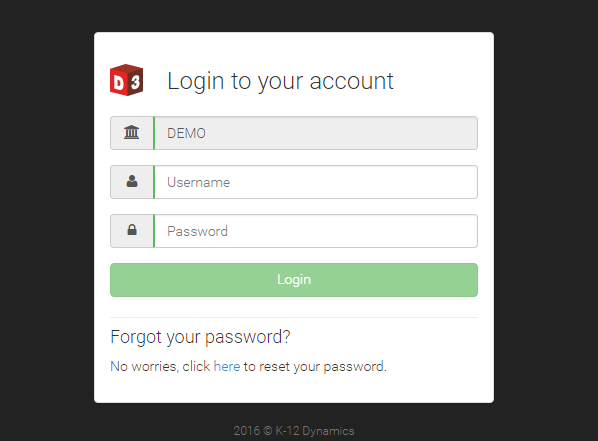
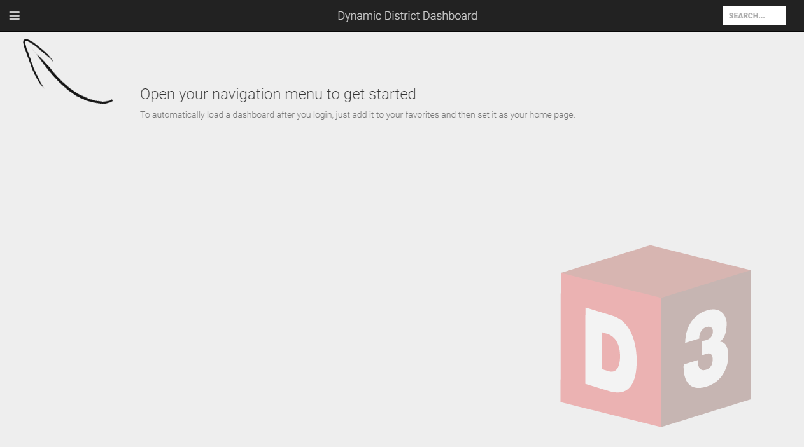

Getting Started
===============

Login
-----
D3 requires every user to log in. For users coming in via the district’s secure portal, the login credentials entered at the district portal will be passed through automatically to D3 using single sign on. However, for users navigating directly to D3, the login screen will be displayed (depicted below) and the user must enter a valid user name and password for the given school district organization. 

   Login screen

Landing Page
------------

Navigation Panel
----------------
Upon successful login, D3 displays your custom home page. If you have not yet designated a home page, you will see the initial landing page instead:

   Initial landing page