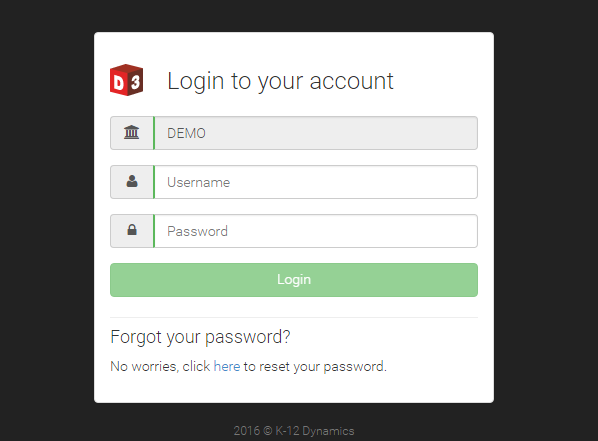
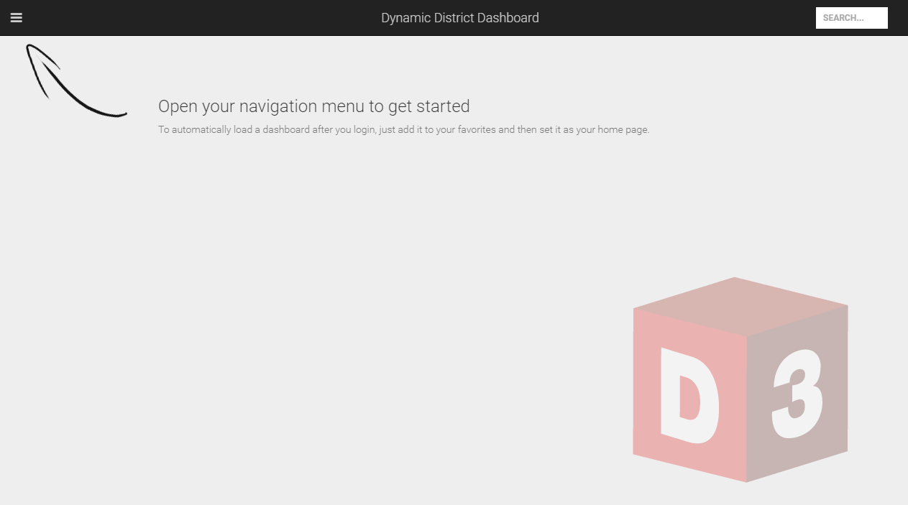

```eval_rst
.. _getting-started-quickstart:
```

# Quickstart

## Login

D3 requires every user to log in. For users coming in via the district’s secure portal, the login credentials entered at the district portal 
will be passed through automatically to D3 using single sign on. However, for users navigating directly to D3, the login screen will be 
displayed (depicted below) and the user must enter a valid user name and password for the given school district organization. 



```eval_rst
.. seealso:: 
   :ref:`admin-credentials`
```

## Landing Page

Upon successful login, D3 displays your custom home page. If you have not yet designated a home page, you will see the initial landing page instead:



## User Interface Elements

D3 has a standard header bar at the top of the application from which all actions within the application can be initiated.

From left-to-right, the purpose of each component in the toolbar is:

1. Access the pull-out menu to open screens in D3.
2. Go back to the previous screen (only visible when there is a previous screen to navigate back to).
3. Title of the current screen.
4. Quick search of all available D3 items (note: on mobile phones a magnifier glass icon is displayed instead of a text box).
5. Expand the sidebar to perform actions and view details applicable to the current screen.


Number 6 in the image above identifies the main content area that displays the current item. In this example, we are looking at a dashboard.

## Navigating Around the App

Click the "hamburger" icon to access the pull-out navigation panel, from which you can access all D3 visualization features.


```eval_rst
.. tip::
   The navigation panel closes automatically once an item is selected, but if you want to close it without selecting an item just click the hamburger icon again.
```

The main area of the navigation panel is a tabbed interface, which provides access to each type of tool within D3. 


The purpose of each tab is as follows:

```eval_rst
* :ref:`Favorites <features-favorites>`: This is a unique view that allows you to quickly access your most used items.
* :ref:`Library <features-library>`: Access dashboards, charts, and other items published to your organization as well as your personally created items.
* :ref:`Scorecards <features-scorecards>`: View many measures at once for a single entity,such as a school or student.
* :ref:`Data Explorer <features-explorations>`: Analyze and drill-down into your data dynamically using this visual explorer.
* :ref:`Watch Lists <features-watchlists>`: Track and monitor individual sets of students, either explicitly or dynamically based on criteria.
* :ref:`Settings <features-settings>`: Manage various configuration settings used within D3.
```

```eval_rst
.. note::
   Availability of each of these tools is based on role, so you may not see all of these tabs.
```

Also, at the bottom of this panel you will see the name of the currently logged in user and a logout button.


## Using Quick Search

Activate the quick search feature from the header bar to quickly locate items in D3.

When activated, enter your search term, or choose from the pick lists of recent items and popular items.

Results are returned in real-time as you type, displaying categorized results of matching items. Click any item to activate it.

## Sidebar Actions

The sidebar is hidden by default to maximize the space given to visualizations displayed in the content area. Selecting the left-pointing double chevron on the far right of the header bar displays the sidebar. Once displayed, the sidebar stays open until you close it or navigate to a new screen.

The items displayed in the sidebar will vary based on what type of visualization is displayed in the content area. You can perform a wide variety of functions from the sidebar, such as:
 
* View explanation, legend, and statistics associated with current visualization
* Link to other tools within D3
* Share and export the current visualization
* Modify the visualization by applying filters, changing the view, of adjusting other settings
* Manage other actions, such as making it your home screen or adding it to your favorities

## Using on Mobile Devices

D3 uses the "responsive web design" approach for building the user interface to provide an optimal viewing and interaction experience across a wide range of devices from desktop computers, to tablets and mobile phones.

```eval_rst
.. tip::

   Did you know you can install D3 as an app on your favorite mobile device for easy access and a full screen experience? Just open D3 in your browser, then...

   **iPhone & iPad**: Tap the share button, and choose "Add to Home Screen".

   **Android**: Tap the menu button and tap "Add to homescreen".
```