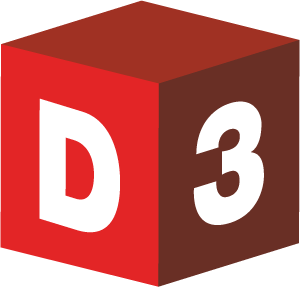

.. D3 documentation master file, created by
   sphinx-quickstart on Thu Jun 09 21:16:20 2016.
   You can adapt this file completely to your liking, but it should at least
   contain the root `toctree` directive.

Welcome to D3's documentation!
==============================

Dynamic District Dashboard (D3) is a dashboard-style software system that gathers, organizes, and presents key information to stakeholders of K-12 school districts. It also provides the tools necessary for integrating and analyzing school district data. D3 works on traditional desktops and laptops; it is also compatible with handheld devices such as smart phones and tablets.

The main documentation for D3 is organized into the following sections:

* :ref:`quickstart-section` - New users should begin here
* :ref:`features-section`
* :ref:`administration-section`
* :ref:`technical-section`

.. _quickstart-section:

.. toctree::
   :maxdepth: 2
   :caption: Quick Start
   :glob:

   quickstart/gettingstarted
   quickstart/tutorials
   quickstart/videos

.. _features-section:

.. toctree::
   :maxdepth: 2
   :caption: Features
   :glob:

   features/*

.. _administration-section:

.. toctree::
   :maxdepth: 2
   :caption: Administration
   :glob:
   
   administration/*
   
.. _technical-section:

.. toctree::
   :maxdepth: 2
   :caption: Technical Reference
   :glob:
   
   technical/*

..  _about-section:

.. toctree::
   :maxdepth: 2
   :caption: About D3
   :glob:

   about/*
   
..
    Indices and tables
    ==================

    * :ref:`genindex`
    * :ref:`modindex`
    * :ref:`search`
