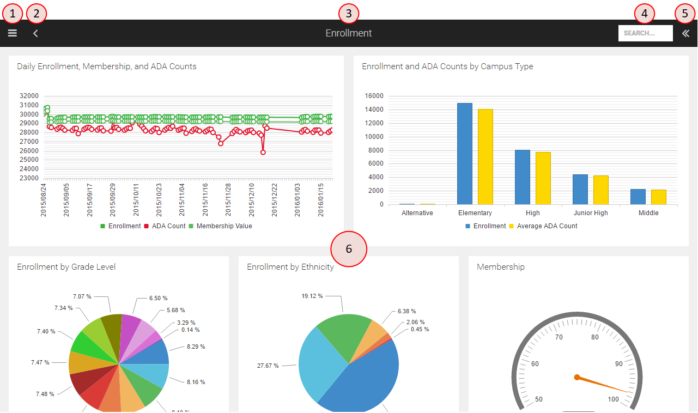

Getting Started
===============

Login
-----
D3 requires every user to log in. For users coming in via the district’s secure portal, the login credentials entered at the district portal will be passed through automatically to D3 using single sign on. However, for users navigating directly to D3, the login screen will be displayed (depicted below) and the user must enter a valid user name and password for the given school district organization. 

.. figure:: img/login.png

   Login screen

.. seealso:: 
   :ref:`admin-credentials`

Landing Page
------------

Upon successful login, D3 displays your custom home page. If you have not yet designated a home page, you will see the initial landing page instead:

.. figure:: img/initial-landing.png

   Initial landing page

User Interface Elements
--------------------------

D3 has a standard toolbar at the top of the application from which all actions within the application can be initiated.

From left-to-right, the purpose of each component in the toolbar is:

1. Access the pull-out menu to open screens in D3.
2. Go back to the previous screen (only visible when there is a previous screen to navigate back to).
3. Title of the current screen.
4. Quick search of all available D3 items (note: on mobile phones a magnifier glass icon is displayed instead of a text box).
5. Expand the sidebar to perform actions and view details applicable to the current screen.

   Main elements of the user interface

Number 6 in the image above identifies the main content area that displays the current item. In this example, we are looking at a dashboard.

Navigating Around the App
---------------------------

.. warning::

   This section hasn't been written yet.

Using on Mobile Devices
--------------------------

D3 uses the "responsive web design" approach for building the user interface to provide an optimal viewing and interaction experience across a wide range of devices from desktop computers, to tablets and mobile phones.

.. tip::

   Did you know you can install D3 as an app on your favorite mobile device for easy access and a full screen experience? Just open D3 in your browser, then...

   **iPhone & iPad**: Tap the share button, and choose "Add to Home Screen".

   **Android**: Tap the menu button and tap "Add to homescreen".