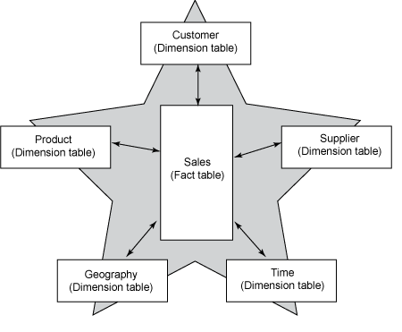

```eval_rst
.. _technical-olap-concepts:
```
# OLAP Concepts in D3

## Introduction

D3 is able to provide results for millions of rows of data in real-time because it leverages an underlying technology called OLAP, or On-Line Analytical Processing. OLAP associates each item of information with the various categories that the information can be grouped by. For example, student daily attendance is a data item,whose values can be grouped by day, week, month, school, grade level, and many other categories. 

For the most part, OLAP is an internal concern for D3. However, when using the Data Explorer it can be helpful to have a basic understanding of how OLAP organizes information, so that you can make decisions about what categories of information to use in what scenarios, as well as how to interpret the aggregation of data values.

## Terminology

Elsewhere in this documentation and in the D3 application, we use only non-technical terms to refer to the structure of data. The remainder of this section, however, provides more detailed technical explanation, and refers to proper OLAP terminology. The following table explains terminology as it is used in various places:

```eval_rst
====================== ======================= ======================
Data Explorer          Chart Component         OLAP Term
====================== ======================= ======================
Value                  Data Series             Fact
Category               Axis                    Dimension Level
====================== ======================= ======================
```

## The Dimensional Model

Databases supporting your operational systems arrange data using a relational model, which is optimized for transaction speed and are normalized to avoid duplication of the same data. These types of databases are designed to support OLTP systems, or Online Transaction Processes.

The way data is stored in OLTPs is suitable for operational needs, which needs to be able to provide efficient data updates as well as fetches.

The demands of decision making systems, such as D3 are different than OLTPs. Their databases arrange data using a dimensional model, which is optimized specifically for reading large amounts of data very quickly to give an overview analysis of what happened.  These types of databases are designed to support OLAP systems, or Online Analytical Processes.

A dimensional model recognizes two types of database tables, the fact table and the dimension table. Fact tables stored transaction details, and relate various dimension tables that provide classification data for the transaction details. Fact tables do not relate to other fact tables, and dimension tables do not (for the most part) related to other dimension tables. This results in what is commonly known as the star schema layout:



You can see from this example that is is easy to visualize how to identify sales information associated with certain product characteristics, from types of suppliers, or customers within certain market segments, or any combination thereof, perhaps also spanning a given time frame such as first quarter of the year.

## The OLAP Engine

As mentioned above, the purpose of an OLAP system is to rapidly process large amounts of data to give an overview analysis of what happened. To achieve this, an OLAP software technology is used to organize dimensional data into OLAP cubes.

The OLAP engine is configured to process the cubes at regular intervals to pre-calculate and store results for the various ways that aggregated facts can be grouped together.

When a query is made to the OLAP cube, these pre-stored results are leveraged to rapidly calculate the results.

## OLAP Measures

When facts are aggregated, the method of aggregation must be specified to provide context, for example:

* Sum
* Count
* Distinct Count
* Min
* Max
* Average
* First
* Last
* Custom Aggregation Function

A fact specified with an associated aggregation context is known as a *Measure*.

Measures are created as needed to support business needs. Take for example, a daily attendance fact. Creating a measure for the sum of daily attendance isn't likely to be useful. Since daily attendance is essentially a boolean value -- the student was either at school or he wasn't, a count of daily attendance is going to produce the same results as a sum, so it also isn't useful. On the other hand, min and max are very likely to be useful, because it is valuable to know what the lowest or the highest attendance was over a given time frame. Similarly, it is useful to know what the average attendance was over a period of time. We also use the last aggregation quite a bit when creating measures, because it is common in business scenarios to be interested in the most recent information.

In practice, the majority of D3 measures actually rely on custom aggregation functions, known in OLAP terms as calculated measures. Calculated measures provide the opportunity to define an aggregation in more complex terms, which is often needed to satisfy business expectations. For example, when defining a measure for average daily attendance, we would want to exclude non-school days. Simply averaging the available data would produce an incorrect results, but average data only for school attendance days, produces the expected result.

```eval_rst
.. seealso:: 
   :ref:`technical-olap-measures`
```

## OLAP Dimensions

Dimensions contains attributes that are used to categorize related facts. Dimension information can be used in queries for both grouping and filtering results.

The attributes of an OLAP dimension are represented in one or more hierarchies of classifications. Each tier in the hierarchy is known as a dimension hierarchy level, or simply a dimension level. It is most common for hierarchies to have only one level, but multiple level hierarchies are also used when a logical sub-classification of attributes is available within the dimension.

Attributes can exist in dimensions that are not associated with any hierarchies. These cannot be used for grouping or filtering results, but they can be included in the returned information for providing additional context, as well as for text-based searches. A good example of this is the student dimension, which includes the first name and last name of the student.

## A Closer Look

Direct use of the OLAP cubes is an advanced feature, which requires technical knowledge that is beyond the scope of most users. However, D3 does provide the ability for those inclined to work with cube data directly. To do so, open the Settings tab (gear icon) from the main menu, and select "Launch Analyzer (advanced use)". With this tool, you can choose a cube, then select dimension levels and measures directly, and drag them to the columns, rows, or measures area to execute OLAP queries directly and view the results.

For the majority of users, the Data Explorer is the recommended tool for analyzing OLAP data. The Data Explorer provides a much simpler interface, greater flexibility, and the ability to visualize results.

